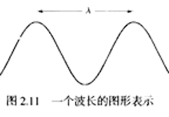
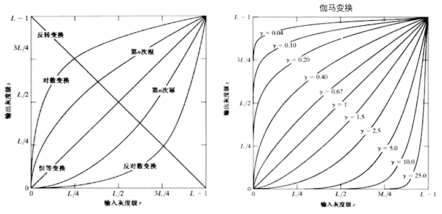

[TOC]

# 一、基本概念

## 1. 光谱即是电磁波谱

- 波长：从红光到紫光，波长不断变短（对于可见光，波长不同，颜色不同）
  

- 灰度级：从黑到白的单色光度量范围
  单色光：无色光，没有颜色的光
  强度：即灰度，单色光的唯一属性

- 发光强度：光源流出的能量总和

- 光通量：观察者从光源感受到的能量，**单位：流明 lumen （LM）**

- 亮度：物体表面的反光率，实际上不能度量，色彩的强度（人眼对亮度的敏感 > 色彩）

  ​

## 2. 数字图像
###2.1 图像属性

- 图像的本质：一个二维数组（矩阵）

- 原点：左上角

- 动态范围：**图中**最大灰度 / **图中**最小灰度

- 噪声：图中多余的干扰信息，低于**图中**最小灰度，便会出现

- 饱和度：即**图中**最大灰度，高于这个值，图中的灰度将会被剪裁掉（彩图中是灰度和色调的比例，0% 灰色 ～ 100% 完全饱和）

- 对比度：**图中**最大灰度 **-** **图中**最小灰度

- 图像分辨率（空间分辨率）：每单位距离的点个数 
  > 相关单位：dpi([点每英寸](https://baike.baidu.com/item/%E7%82%B9%E6%AF%8F%E8%8B%B1%E5%AF%B8)）、lpi（线每英寸）和ppi（[像素每英寸](https://baike.baidu.com/item/%E5%83%8F%E7%B4%A0%E6%AF%8F%E8%8B%B1%E5%AF%B8))

$$
PPI = {\sqrt{像素长^2 + 像素宽^2} \over \sqrt{屏幕长^2 + 屏幕宽^2}}
$$

###2.2 像素

- 邻接性：
  有时候也用非矩形的邻域（比如：圆形），但矩形邻域是目前为止最好的邻域，因为它在计算上更为容易
  

- 像素通路：从起点像素到终点像素相邻像素的连线
  必须保证唯一，创建通路前要确定使用哪种邻接

- 像素间距离计算：例，求 $A(x_a, y_a)、B(x_b, y_b)$ 间的距离
  欧式距离：最短距离 $D_e(A, B) = \sqrt{(x_b - x_a)^2+ (y_b - y_a)^2}$
  D4 距离：每次只能横、竖、走 4 邻接像素 $D_4(A,B) = |x_b - x_a|, |y_b - y_a|$
  D8 距离：每次只能横、竖、**斜**走 8 邻接像素 $D_8(A,B) = max(|x_b - x_a|, |y_b - y_a|)$

##3. 图像处理基本

###3.1 图像的收缩和放大

- 线性插值（nearest）：例，根据 $Q(x_0,y_0)，R(x_1,y_1)  \Rightarrow  P_{插值后}(x, y)$
  $$
  {y - y_0 \over x - x_0} = {y_1 - y_0 \over x_1 - x_0}
  $$

- 双线性插值（bilinear）：**结果与插值的 X、Y 方向先后顺序无关**
  缺点：对角线过渡不平滑，细节退化
  计算方法：

  1. X 方向线性插值：根据 4 个 Q 点分别求出 R1，R2
  2. Y 方向线性插值：根据 R1，R2 求出 P
  
  ​
- 双三次内插值（bicubic）：双线性插值的三维拓展

### 3.2 图像的线性操作

- 阵列操作：表示图像的矩阵中每个对应元素之间的操作
  例，**阵列**相乘
  $$
  \begin{bmatrix}
  \color{red}{a_{11}} & \color{red}{a_{21}} \\
  a_{12} & a_{22} \\
  \end{bmatrix}
  \begin{bmatrix}
  \color{green}{b_{11}} & b_{21} \\
  \color{green}{b_{12}} & b_{22} \\
  \end{bmatrix}
  =
  \begin{bmatrix}
  \color{red}{a_{11}}\color{green}{b_{11}} & \color{red}{a_{21}}b_{21} \\
  a_{12}\color{green}{b_{12}} & a_{22}b_{22} \\
  \end{bmatrix}
  $$

- 符合线性代数的条件下使用线性代数公式
  例，**矩阵**相乘：行 X 列
  $$
  \begin{bmatrix}
  \color{red}{a_{11}} & \color{red}{a_{21}} \\
  a_{12} & a_{22} \\
  \end{bmatrix}
  \begin{bmatrix}
  \color{green}{b_{11}} & b_{21} \\
  \color{green}{b_{12}} & b_{22} \\
  \end{bmatrix}
  =
  \begin{bmatrix}
  \color{red}{a_{11}}\color{green}{b_{11}}+\color{red}{a_{21}}\color{green}{b_{12}} &
  \color{red}{a_{11}}b_{21}+\color{red}{a_{21}}b_{22} \\
  a_{12}\color{green}{b_{11}}+a_{22}\color{green}{b_{12}} & a_{12}b_{21}+a_{22}b_{22} \\
  \end{bmatrix}
  $$

- [其他线性代数问题](https://github.com/CatOnly/CrashNote/blob/master/LinearAlgebra/Part0.md)

### 3.3 图像的概率方法

### 3.4 图像的灰度变换 

- 图像反转：突出图像暗区域中白色或灰色部分，公式：$$ s = (L-1) -r $$

- 对数变换：$$s = c \cdot  log(1 + r)，r \geq 0，c  是常数$$
  主要用来压缩像素值变化较大的动态范围

- 幂律（伽马）变换：$$s = c \cdot r^\gamma$$
  当 c = 1 时，**显著**提高暗部亮度，可以提高亮部的亮度，如图下所示

  

## 3. 空间域

空间域技术：直接在图像像素上操作，针对图像本身

### 3.1 空间滤波

定义：

空间滤波器（也称为，空间掩膜、核、模版、窗口）：

