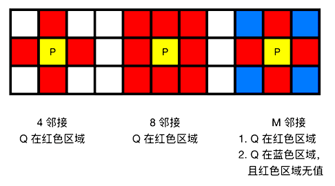
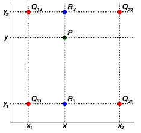

[TOC]

# 一、基本概念

## 1. 光谱即是电磁波谱

- 波长：从红光到紫光，波长不断变短（对于可见光，波长不同，颜色不同）
  

- 灰度级：从黑到白的单色光度量范围
  单色光：无色光，没有颜色的光
  强度：即灰度，单色光的唯一属性

- 发光强度：光源流出的能量总和

- 光通量：观察者从光源感受到的能量，**单位：流明 lumen （LM）**

- 亮度：物体表面的反光率，实际上不能度量，色彩的强度（人眼对亮度的敏感 > 色彩）

  

## 2. 数字图像
###2.1 图像属性

- 图像的本质：一个二维数组（矩阵）

- 原点：左上角

- 动态范围：**图中**最大灰度 / **图中**最小灰度

- 噪声：图中多余的干扰信息，低于**图中**最小灰度，便会出现

- 饱和度：即**图中**最大灰度，高于这个值，图中的灰度将会被剪裁掉（彩图中是灰度和色调的比例，0% 灰色 ～ 100% 完全饱和）

- 对比度：**图中**最大灰度 **-** **图中**最小灰度

- 图像分辨率（空间分辨率）：每单位距离的点个数 
  > 相关单位：dpi([点每英寸](https://baike.baidu.com/item/%E7%82%B9%E6%AF%8F%E8%8B%B1%E5%AF%B8)）、lpi（线每英寸）和ppi（[像素每英寸](https://baike.baidu.com/item/%E5%83%8F%E7%B4%A0%E6%AF%8F%E8%8B%B1%E5%AF%B8))

$$
PPI = {\sqrt{像素长^2 + 像素宽^2} \over \sqrt{屏幕长^2 + 屏幕宽^2}}
$$

###2.2 像素

- 邻接性：
  有时候也用非矩形的邻域（比如：圆形），但矩形邻域是目前为止最好的邻域，因为它在计算上更为容易
  

- 像素通路：从起点像素到终点像素相邻像素的连线
  必须保证唯一，创建通路前要确定使用哪种邻接

- 像素间距离计算：例，求 $A(x_a, y_a)、B(x_b, y_b)$ 间的距离
  欧式距离：最短距离 $D_e(A, B) = \sqrt{(x_b - x_a)^2+ (y_b - y_a)^2}$
  D4 距离：每次只能横、竖、走 4 邻接像素 $D_4(A,B) = |x_b - x_a|, |y_b - y_a|$
  D8 距离：每次只能横、竖、**斜**走 8 邻接像素 $D_8(A,B) = max(|x_b - x_a|, |y_b - y_a|)$

##3. 图像处理

###3.1 图像的收缩和放大

- 线性插值（nearest）：例，根据 $Q(x_0,y_0)，R(x_1,y_1)  \Rightarrow  P_{插值后}(x, y)$
  $$
  {y - y_0 \over x - x_0} = {y_1 - y_0 \over x_1 - x_0}
  $$

- 双线性插值（bilinear）：**结果与插值的 X、Y 方向先后顺序无关**
  缺点：对角线过渡不平滑，细节退化
  计算方法：

  1. X 方向线性插值：根据 4 个 Q 点分别求出 R1，R2
  2. Y 方向线性插值：根据 R1，R2 求出 P
  
  ​
- 双三次内插值（bicubic）：双线性插值的三维拓展

### 3.2 图像的线性操作

- 阵列操作：表示图像的矩阵中每个对应元素之间的操作
  例，**阵列**相乘
  $$
  \begin{bmatrix}
  \color{red}{a_{11}} & \color{red}{a_{21}} \\
  a_{12} & a_{22} \\
  \end{bmatrix}
  \begin{bmatrix}
  \color{green}{b_{11}} & b_{21} \\
  \color{green}{b_{12}} & b_{22} \\
  \end{bmatrix}
  =
  \begin{bmatrix}
  \color{red}{a_{11}}\color{green}{b_{11}} & \color{red}{a_{21}}b_{21} \\
  a_{12}\color{green}{b_{12}} & a_{22}b_{22} \\
  \end{bmatrix}
  $$

- 符合线性代数的条件下使用线性代数公式
  例，**矩阵**相乘：行 X 列
  $$
  \begin{bmatrix}
  \color{red}{a_{11}} & \color{red}{a_{21}} \\
  a_{12} & a_{22} \\
  \end{bmatrix}
  \begin{bmatrix}
  \color{green}{b_{11}} & b_{21} \\
  \color{green}{b_{12}} & b_{22} \\
  \end{bmatrix}
  =
  \begin{bmatrix}
  \color{red}{a_{11}}\color{green}{b_{11}}+\color{red}{a_{21}}\color{green}{b_{12}} &
  \color{red}{a_{11}}b_{21}+\color{red}{a_{21}}b_{22} \\
  a_{12}\color{green}{b_{11}}+a_{22}\color{green}{b_{12}} & a_{12}b_{21}+a_{22}b_{22} \\
  \end{bmatrix}
  $$

- [其他线性代数问题](https://github.com/CatOnly/CrashNote/blob/master/LinearAlgebra/Part0.md)

### 3.3 图像的概率方法

- 基本概率：概率 = 符合条件事件数 / 事件总数
- 期望值：概率加权后的和
  当事件总数不可知（或者无法求得），但是知道概率分布（符合条件的每个概率值），从而求得的整体的平均值
- 方差：随机变量和期望的偏离程度
  方差公式：$\sigma^2 = {\sum_1^n(X - \mu)^2 \over n}, \sigma 标准差、X 随机变量、\mu期望、n随机变量总量$
- **概率密度函数（PDF）**：连续随机变量存在随机变量 $x$ 与其出现的概率 $f(x)$，求规定 $x$ 范围内的可能性，就是求概率密度函数 $f(x)$ 在这个范围的积分
- **累积分布函数（CDF）**：概率密度函数的积分，能完整描述一个实随机变量 $X$ 的概率分布

### 3.4 图像的灰度变换函数 

- 图像反转：$ s = (L-1) -r $
  突出图像暗区域中白色或灰色部分

- 对数变换：$s = c \cdot  log(1 + r)，c  常数$
  主要用来压缩像素值变化较大的动态范围

- 伽马变换：$s = c \cdot r^\gamma，c 常数$
  又称幂律变换，当 c = 1 时，**显著**提高暗部亮度，可以提高亮部的亮度，如图下所示

  

### 3.5 图像的直方图处理

图像的直方图：图像各个灰度级出现概率的直方图
特点：暗的图像直方图主要分布在灰度级低的位置，高对比度的图像直方图分布均匀，低对比度的直方图主要分布在灰度级的中间位置

**直方图均衡**：利用图像直方图 **对** 对比度进行调整的方法

- 方法：原始直方图 => 灰度变换函数 处理 => 均衡后的直方图
- 作用：用于作为增强局部对比度而不影响整体对比度的自适应工具

**直方图匹配**：处理图像使其得到指定的概率密度

- 方法：不需要求得 灰度变换函数，只需要存储 灰度变换函数对应的 输入输出表格用查表法来得到相应的数据
- 作用：通过得到**指定**概率密度的 灰度变换函数使图像局部增强
  

# 二、空间域滤波

> 空间域技术：直接在图像像素上操作，针对图像本身，**可用于非线性滤波，这在频率域中无法做到**
>
> 滤波：接受/拒绝 一定的频率分量
> 低通滤波器：通过低频的滤波器处理结果模糊（平滑）的图像
> 空间滤波器（也称为，空间掩膜、核、模版、窗口）

## 1. 空间滤波基础

- 空间滤波方法：通过中心像素和其邻域**执行特定的方法**生成新像素
- 空间滤波器（模版）：通过特定的方法得到的对应像素的权重集合
- 线性空间滤波器：执行特定的方法是线性操作的空间滤波器（对于边缘像素的计算结果，根据纹理的环绕方式的不同而不同）
  
  
空间相关/卷积：滤波器移过图像，计算每个位置乘积之和得出对应像素值的处理方法

> 离散单位冲激：包含单个 1 其余都是 0 的函数/矩阵

- 处理方法，**空间相关**：
    $$
    输入图像
    \begin{bmatrix}
    0 & 0 & 0 & 0 & 0\\
    0 & 0 & 0 & 0 & 0\\
    0 & 0 & \color{red}1 & 0 & 0\\
    0 & 0 & 0 & 0 & 0\\
    0 & 0 & 0 & 0 & 0
     \end{bmatrix}
     \Rightarrow
     滤波器 w
     \begin{bmatrix}
    1 & 2 & 3\\
    4 & 5 & 6\\
    7 & 8 & 9
     \end{bmatrix}
     {逐像素处理 \over \Rightarrow}
     全部相关结果
    \begin{bmatrix}
    0 & 0 & 0 & 0 & 0 & 0 & 0 & 0 & 0\\
    0 & 0 & 0 & 0 & 0 & 0 & 0 & 0 & 0\\
    0 & 0 & 0 & 0 & 0 & 0 & 0 & 0 & 0\\
    0 & 0 & 0 & \color{red}9 & \color{red}8 & \color{red}7 & 0 & 0 & 0\\
    0 & 0 &0 & \color{red}6 & \color{red}5 & \color{red}4 & 0 & 0 & 0\\
    0 & 0 &0 & \color{red}3 & \color{red}2 & \color{red}1 & 0 & 0 & 0\\
    0 & 0 & 0 & 0 & 0 & 0 & 0 & 0 & 0\\
    0 & 0 & 0 & 0 & 0 & 0 & 0 & 0 & 0\\
    0 & 0 & 0 & 0 & 0 & 0 & 0 & 0 & 0
     \end{bmatrix}
     { 剪裁 \over \Rightarrow}
    输出图像
    \begin{bmatrix}
    0 & 0 & 0 & 0 & 0\\
    0 & \color{red}9 & \color{red}8 & \color{red}7 & 0\\
    0 & \color{red}6 & \color{red}5 & \color{red}4 & 0\\
    0 & \color{red}3 & \color{red}2 & \color{red}1 & 0\\
    0 & 0 & 0 & 0 & 0
     \end{bmatrix}
    $$

- 处理方法，**空间卷积**：
  $$
  输入图像
  \begin{bmatrix}
  0 & 0 & 0 & 0 & 0\\
  0 & 0 & 0 & 0 & 0\\
  0 & 0 & \color{red}1 & 0 & 0\\
  0 & 0 & 0 & 0 & 0\\
  0 & 0 & 0 & 0 & 0
   \end{bmatrix}
   {180 度翻转 w  \over \Rightarrow}
   滤波器 w^T
   \begin{bmatrix}
  9 & 8 & 7\\
  6 & 5 & 4\\
  3 & 2 & 1
   \end{bmatrix}
   {逐像素处理 \over \Rightarrow}
   全部卷积结果
  \begin{bmatrix}
  0 & 0 & 0 & 0 & 0 & 0 & 0 & 0 & 0\\
  0 & 0 & 0 & 0 & 0 & 0 & 0 & 0 & 0\\
  0 & 0 & 0 & 0 & 0 & 0 & 0 & 0 & 0\\
  0 & 0 & 0 & \color{red}1 & \color{red}2 & \color{red}3 & 0 & 0 & 0\\
  0 & 0 & 0 & \color{red}4 & \color{red}5 & \color{red}6 & 0 & 0 & 0\\
  0 & 0 & 0 & \color{red}7 & \color{red}8 & \color{red}9 & 0 & 0 & 0\\
  0 & 0 & 0 & 0 & 0 & 0 & 0 & 0 & 0\\
  0 & 0 & 0 & 0 & 0 & 0 & 0 & 0 & 0\\
  0 & 0 & 0 & 0 & 0 & 0 & 0 & 0 & 0
   \end{bmatrix}
   { 剪裁 \over \Rightarrow}
  输出图像
  \begin{bmatrix}
  0 & 0 & 0 & 0 & 0\\
  0 & \color{red}1 & \color{red}2 & \color{red}3 & 0\\
  0 & \color{red}4 & \color{red}5 & \color{red}6 & 0\\
  0 & \color{red}7 & \color{red}8 & \color{red}9 & 0\\
  0 & 0 & 0 & 0 & 0
   \end{bmatrix}
  $$
  

## 2. 平滑空间滤波器

**作用：用于模糊处理，降低噪声**
使用 3 X 3、5 X 5 或更大的空间滤波器，效果更明显

### 2.1 平滑线性滤波器（均值滤波器）

方法：中心像素的值为滤波器模版邻域内像素简单的加权平均值
特点：滤波器个系数加权之和为 1
缺点：出现边缘模糊
例：
$$
\begin{array}{rr}
{ 1 \over 9 } \times
 \begin{bmatrix}
1 & 1 & 1\\
1 & 1 & 1\\
1 & 1 & 1
 \end{bmatrix}
 &
 { 1 \over 16 } \times
  \begin{bmatrix}
1 & 2 & 1\\
2 & 4 & 2\\
1 & 2 & 1
 \end{bmatrix}
\\
均值滤波器 A & 均值滤波器 B
\end{array}
$$

###2.2 统计排序（非线性）滤波器

方法：中心像素的值为滤波器模版邻域内像素值安一定规则排序后，从统计排序结果中选取的

缺点：非线性滤波器可能改变图像的性质，这在医学是不能接受的

例：中值滤波，中心像素的值为滤波器模版邻域内像素值从小到大排列后，位置排在中间的像素的值

## 3. 锐化空间滤波器

**作用：突出灰度过渡的部分**
锐化空间滤波器的关键数学工具：**微分**
**微分**：函数  $f(x)$ 在 $dx$ 的微分是，函数  $f(x)$ 在 $dx$ 处的极限，具体意义如下

- 直线 T 为 曲线 $f(x)$ 上 P 点的切线，是 ${df \over dx}$ 的图像
  曲线 L 为 曲线 $f(x)$ 的图像
- 当增量 $dx$ 趋于无穷小时， $f(x) - df$ 的差别也趋于无穷小，所以**在 P 点附近**可以用 切线 T 来的代替曲线 L 的值

一维的微分公式
- 一阶微分：${df \over dx} = {f(x+1) - f(x) \over (x+1) -x} = f(x+1) - f(x)$
- 二阶微分：${d^2f \over dx^2} = {d({df \over dx})\over dx} = f(x+1) +f(x-1) - 2f(x)$

###3.1 梯度（一阶微分）

特点：边缘增强

方法：

- 具有旋转不变的特性（各向同性），根据对一阶微分 ${df \over dx}$ 的计算不同而不同，基本思路是：
  $g_{中心}(x,y) = \sqrt{({df \over dx})^2 + ({df \over dy})^2}$
- 具有旋转改变的特性（各向异性），为了方便计算：
  $g_{中心}(x,y) \approx |{df \over dx}| + |{df \over dy}|$
- 为不影响其他像素的值，滤波器个系数加权和为 0

### 3.2 拉普拉斯算子（二阶微分）

特点：增强图像细节，增强灰度的突变，减弱灰度的缓慢变化区
缺点：比梯度操作产生更多的噪点

拉普拉斯算子是二维的二阶微分，公式为：$\Delta^2f(x, y) = f(x+1,y) +f(x-1,y)+f(x,y+1) +f(x,y-1)-4f(x,y)$

使用方法：

- $g_{中心}(x,y) = f_{中心}(x,y)+滤波器中心系数的符号\cdot \Delta^2f(x,y)$
- 为不影响其他像素的值，滤波器个系数加权和为 0

### 3.3 非锐化掩蔽和高提升滤波（不用微分）

方法：原图像 A ${模糊 \over \Rightarrow}$ 模糊图像 G ${A - G \over \Rightarrow}$ 差值图像 D ${A + D \over \Rightarrow}$ 锐化图像

### 3.4 多种滤波的混合使用举例

锐化图像：愿图像 $\rightarrow$ 梯度滤波 $\rightarrow$ 平滑线性滤波 $\rightarrow$ 拉普拉斯滤波 $\rightarrow$ 锐化后的图像

## 4. 模糊技术

作用：为处理不严密信息提供了一种形式

模糊集合：集合中的某元素 A 在集合中的隶属度（符合集合定义的程度，一般介于 0 ～ 1）组成的有序对

集合操作与数学计算：

- 集合 A   的补集：$1 - A$
- 集合 AB 的并集：$max(A, B)$
- 集合 AB 的交集： $min(A, B)$

**方法**：

1. 找到处理图像的**各个**影响因素和其对应的隶属度的关系 A、B、C...
2. 将**各个**关键关系 A、B、C… 进行集合操作得到模糊集合
3. 将模糊集合通过**一种计算方法**（以下几个例子都用了计算集合中心的方法）得出一个计算方程

### 4.1 模糊技术处理灰度

根据 黑、灰、白 和 其隶属度的关系 的模糊集合，使用重心的计算方法得到灰度处理方法
$$
v_{输出} = {
f_黑(x_{隶属度}) \times  v_黑 + g_灰(x_{隶属度}) \times  v_灰 + h_白(x_{隶属度}) \times  v_白 
\over 
f_黑(x_{隶属度})  + g_灰(x_{隶属度})  + h_白(x_{隶属度}) 
}
$$

### 4.2 模糊技术进行空间滤波

假设 黑色 == 平滑，白色 == 边缘，则边缘检测如下

图 4.2.A 为：灰度差为 0 和其集合隶属关系
图 4.2.B 为：黑色 和 白色与其集合隶属关系
根据图 4.2.AB 构成的模糊集合通过边缘提取的计算方法（只要与中心像素 **4邻接**的两个**相邻**灰度差均为 0 时，中间点为白色）

# 三、频率域滤波

## 1. 频率域滤波基础
###1.1 基本概念
###1.2 傅立叶变换
####1.2.1 取样函数的傅立叶变换
####1.2.2 单变量的离散傅立叶变换(DTF)
####1.2.3 二维离散傅里叶变换的性质
## 2. 频率域滤波平滑图像
## 3. 频率域滤波锐化图像

## 4. 选择性滤波

## 5. 滤波器实现

