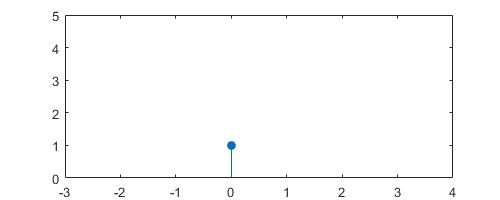
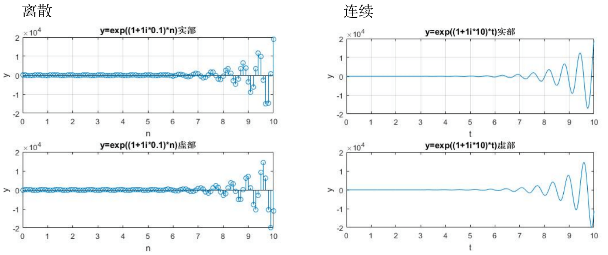

[TOC]

# 一、信号与系统

信号可以来自于很多外部设备：录音机、温度计、相机

**信号处理的方向**：并不关心数据以怎样自然规律产生，而是重点放在如何改变输入的信号数据

- 模拟信号：连续不断的，针对具体外界做出的具体测量值，没有取值范围
- 数字信号：离散采样的，具有时间和幅度两个分量，将模拟信号限定在一个**固定**的测量范围后，表示**局部模拟信号**波动的值，在传输时具有较强的抗干扰能力

## 1. 信号的系统

> 信号的系统指一系列处理信号的**方法**，

### 1.1 信号系统的分类

- 线性 Linear / 非线性 Non-linear
- 时不变 time-inveriant / 时变 time-varying

### 1.2 对信号分析和表达的作用域

- 时域：从时间的角度分析信号
- 频率域：从信号频率角度分析信号
- 空间域：从信号发生空间位置角度分析信号

## 2. 信号的分类

> 信号在离散和连续时有相同也有不同的特性，比如：一个正弦信号，如果周期不是整数，那虽然在连续信号里它具有周期性，但是在离散信号里，没有周期性

**脉冲信号**：一种离散信号（即，离散时间信号，指信号在时间这个轴上是离散的），波形之间在 Y 轴不连续，具有一定周期性

### 2.1 单位脉冲信号

$$
\begin{array}{rrl}
Original & \delta(n) =& 
\begin{cases}
1,& n=0\\
0,& otherwise
\end{cases}\\
Offset & \delta(n-n') =& 
\begin{cases}
1,& n=n'\\
0,& otherwise
\end{cases}\\\\
2D Discrete & \delta(n) =& f_1(n_1)\cdot f_2(n_2)
\end{array}
$$

### 2.2 单位跃阶信号

$$
\begin{array} {rrl}
Original & u(n) =& 
\begin{cases}
1,& n\geq0\\
0,& otherwise
\end{cases}\\
Offset & u(n-n') =& 
\begin{cases}
1,& n \geq n'\\
0,& otherwise
\end{cases}\\\\
2D Discrete & u(n_1, n_2) =& 
u_1(n_1)\cdot u_2(n_2)
\end{array}
$$

### 2.3 正弦信号

A 振幅，$\omega_0$ 频率，$\phi$ 相位（指偏移量），$T_0 = {2 \pi \over \omega_0}$ 周期
$$
u(t) = A \space cos(\omega_0 t + \phi)
$$

### 2.4 指数信号

指数信号
$$
u(t) = C e^{at}，(C \space 和 \space a \space 是实数)
$$

复指数信号
$$
u(t) = C e^{at}，(C \space 和 \space a \space 是复数)\\
u(t) = |C|e^{rt}e^{(j\omega_0t+ \theta)}
$$

# 二、卷积

## 1. 信号的可以被拆解

> 一般来说，一个脉冲信号可以被分解为多个单位脉冲信号加权之和

### 1.1 傅立叶级数

傅立叶级数：任何周期函数，都可以用一系列的 sin 函数 和 cos 函数的和来表示

### 1.2 离散信号序列的拆解

以下图 $x$ 信号序列为例：

已知单位脉冲信号序列 $\delta[n]$：
$$
\delta(n) =
\begin{cases}
1,& n=0\\
0,& otherwise
\end{cases}\\
$$
则脉冲信号序列 $x[n]$：
$$
\begin{array}{lll}
x[0] &= 2 &= 2 \cdot \delta[n - 0] &= x[0] \cdot \delta[n - 0] \\
x[1] &= 3 &= 3 \cdot \delta[n - 1] &= x[1] \cdot \delta[n - 1] \\
x[2] &= 1 &= 1 \cdot \delta[n - 2] &= x[2] \cdot \delta[n - 2] \\ \\
\end{array} \\
\begin{array}{lll}
x[n] &= x[0] + x[1] + x[2],(n=1,2,3) \\
&= x[0] \cdot \delta[n - 0] + x[1] \cdot \delta[n - 1] + x[2] \cdot \delta[n - 2],(n=1,2,3) \\ \\
x[n] &= \sum_{k = - \infin}^\infin x[k] \cdot \delta[n - k], \space(这里将序列信号 x 的序列个数 n 推广到 -\infin 到 \infin)
\end{array}
$$

## 2. 单位脉冲响应

**单位脉冲响应**：通过单位脉冲信号输入系统后，得到的输出信号（信号经过系统处理后的结果），一般用 $h[n]$ 表示

**单位脉冲响应有以下几个特性**：

1. 系统以时间为变量时，输入单位脉冲会得到对应时间偏移的单位脉冲响应

2. 系统为线性变换系统时，单位脉冲响应结果也满足对应输入的线性变换
   
   
3. 多个单位脉冲输入时，在经过系统处理后也会得到相应数目个单位响应脉冲
   
   
   

结合单位相应脉冲的性质和离散信号的拆解方式后的处理过程，就是卷积
   

## 3. 离散时阈下的卷积

**卷积公式**，其中
y 为输出信号序列（卷积结果）
x 为输入信号序列
h 当前输入信号对应的**脉冲响应结果**（信号系统处理后的到的值）
n 当前输入信号的序列号
$$
y[n] = \sum_{k = -\infin}^\infin x[k]\cdot h[n - k]
$$

## 4. 一维信号的卷积

## 5. 二维信号的卷积

# 三、傅立叶变换

# 引用

1. [正弦信号，指数信号](https://www.cnblogs.com/zhiyinglky/p/5805315.html)
2. [跃阶信号](https://www.cnblogs.com/zhiyinglky/p/5805314.html)
3. [Fundamentals of Digital Image and Video Processing](https://github.com/giosans/Fundamentals-of-Digital-Image-and-Video-Processing-course)
4. [Signals and Systems](http://open.163.com/movie/2011/8/7/A/M8AROL7GG_M8AROT67A.html)
5. [Convolution](http://www.songho.ca/dsp/convolution/convolution.html)