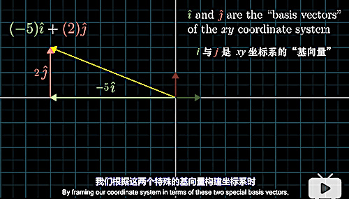
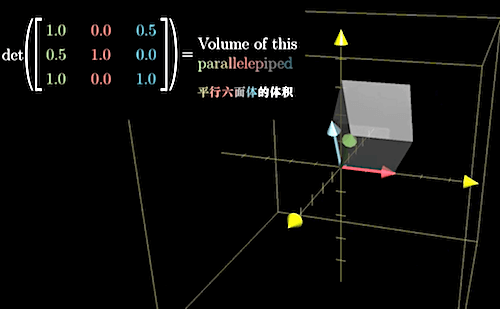
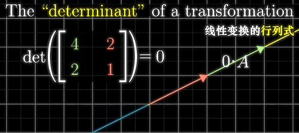
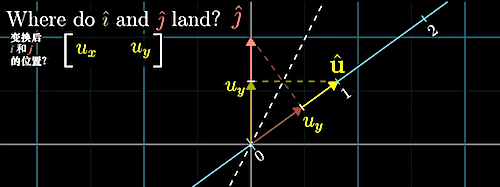
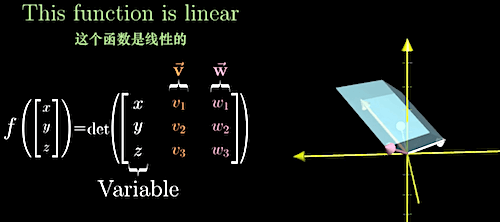
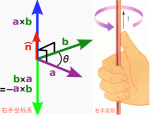
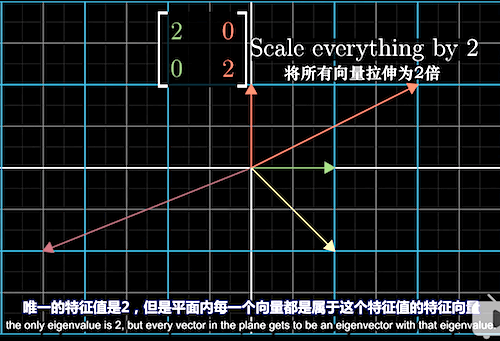

[TOC]

# 一、向量

##1. 概念

- 起点是原点
- 向量 = 方向 + 大小
- **位置移动** 的数值记录
- **线性变换** 的数值记录

##2. 基本运算 

- 向量的加法
  
  ​
- 向量的缩放
  
  ​

## 3. 向量的基

- 向量的基 == 单位向量
- 向量的值 **依赖** 于基
  

- 向量空间的一个基是 **张成** 该空间的 **线性无关** 向量集
  ​

# 二、张成空间

## 1. 概念

- 二维的张成空间
  

- 三维的张成空间
  
  ​

## 2. 线性相关

- 线性相关：有多组向量构成张成空间，移除其中一个 **不减少** 张成空间的大小
线性无关： 所有向量 给张成空间增添了新的维度

- 线性相关：多组向量中，有向量 = 其他向量的线性组合
  
  
- 齐次向量：表示同一条直线的一类向量
# 三、线性变换

## 1. 概念

- 实质：操作空间的一种手段

- 原点固定

- 直线在变换后保持直线

- 网格保持 **平行** 且 **等距分布**

  
  ​

## 2. 矩阵左乘（列向量矩阵）

- 实质：求出右边的向量 **对应基坐标变化后的值**

- 线性变换后的基坐标 == 矩阵
  

- 矩阵 * 向量 == 该向量对应 **基坐标的线性变换** 后的值

  

## 3. 矩阵相乘（状态变化）

- 实质：先后切换**基坐标**的状态
  例子：矩阵B * 矩阵A * 向量C == 将向量C **先按照 矩阵A 变换**，再按照矩阵B 变换
  

- 矩阵相乘**不遵循**交换律

  例子：矩阵B * **矩阵A** != **矩阵A** * 矩阵B

- 矩阵相乘结合律：(AB) C == A (BC)
  由于**都是从 最右边的 C 开始变换**，从几何角度看没有区别

- 矩阵相乘公式
  

# 四、行列式（面积变化比例）

## 1. 概念

- 表示：区域 **面积** 线性变换后增大和减小的 **比例**
  **符号取决于** 区域是否发生了翻转变换（翻转为 负）
  行列式的值与所选坐标系无关
  

- 表示：区域 **体积** 线性变换后增大和减小的 **比例**
  **符号取决于** 构成矩阵的这三个向量**是否满足右手定则**（不满足为 负）
  
## 2. 特殊情况

- 当线性变化后 区域 **面积** 为 0 时（点，线）
  说明发生了由 **高维到低维** 的线性变换
  

- 当线性变化后 区域 **体积** 为 0 时（点，线，面）
  

- 当线性变化后 比例为 **负数**  时，平面翻转
  
  
## 3. 公式

- 
  ​

#五、矩阵和线性方程组

## 1. 线性方程组 转 矩阵

- 求线性方程组的解，就是求线性变化的向量
 

## 2. 列空间

- **零向量** 一定在列空间中（因为线性变换必须保持原点不变）
 

## 3. 秩

- 实质：线性变换后空间的 **维数**
- 定义：列空间的维数
- 满秩：秩 == 列数

## 4. 零空间

- 当一个矩阵不是满秩的时候，会出现零空间
- 实质：线性变换后落在原点的集合
- 当线性方程组线性变换前 **V 向量为 0 时**，零空间就是该线性方程组 **解的集合**

## 5. 逆矩阵

- 前提：矩阵的行列式的值不为 0
- 可以利用矩阵的逆阵求解方程组。
- 实质：矩阵A 线性变换后，在变换矩阵A 的逆矩阵，向量的基不变。且无论先后顺序，向量的基都不变。（恒等变换）
   
   
## 6. 非方阵
- 3 X 2 矩阵的几何意义：将 **二维** 空间映射到 **三维**空间上

# 六、向量的点积（投影）

##1. 概念
- 数学计算，遵循乘法交换律（都是长度乘长度）
  
  $$
  \begin{bmatrix} 
  \color{green}{1} \\  \color{red}{2} \\ 
  \end{bmatrix} \cdot
  \begin{bmatrix} 
  \color{green}{3} \\  \color{red}{4} \\ 
  \end{bmatrix} = \color{green}{1} \cdot \color{green}{3} + \color{red}{2} \cdot \color{red}{4}
  $$

- 几何解释
  V * W > 0 方向相同
  V * W < 0 方向反相
  V * W = 0 互相垂直
  **W** 到 V 的投影的长度 * V 的长度
  

##2. 通过线性变换理解点积
1. 二维向量 线性变换到 一维向量

  `基向量 X: (0, 1) -> 1`
  `基向量 Y: (1, 0) -> -2`

  

2. 利用对称性，二维平面上一个向量 u，变换到 一维的一条线上
  

3. 上述 1- 2 情况下，矩阵A * 向量B == 向量C * 向量B
  向量B 和 向量C 的**点积的值**可以用 向量B 到 C 的投影值 和 向量 C 的值的积求出
  

4. 综上，矩阵A 这样的由二维到一维的线性变换过程 可以用 向量C 表示，并且 **矩阵A 和 向量C** 一一对一
  

# 七、向量的叉乘（面积）

## 1. 概念

- 叉乘计算：求两个向量组合成的矩阵的行列式值（矩阵的转置矩阵不改变行列式的值）
  

- 几何意义：叉乘的两个向量的面积（叉乘和方向有关， **不遵循交换律**）
  正方向：右边向量 X **左边向量**
  反方向：**左边向量** X 右边向量
  

- 实际作用：通过 2 个三维向量生成 1 个**新的三维向量**
**叉乘的结果是一个向量**
  

- 公式
  ​
  $$
  \begin{bmatrix} 
  \color{green}{v_1} \\  \color{red}{v_2} \\ \color{blue}{v_3}\\ 
  \end{bmatrix} \times
  \begin{bmatrix} 
  \color{green}{w_1}  \\ \color{red}{w_2} \\ \color{blue}{w_3} \\ 
  \end{bmatrix} = 
  \begin{bmatrix} 
  \color{red}{v_2} \cdot  \color{blue}{w_3} - \color{blue}{v_3}\cdot \color{red}{w_2} \\
  \color{blue}{v_3} \cdot  \color{green}{w_1} - \color{green}{v_1}\cdot \color{blue}{w_3} \\
  \color{green}{v_1} \cdot  \color{red}{w_2} - \color{red}{v_2}\cdot \color{green}{w_1} \\
  \end{bmatrix}
  \\ \Downarrow \\
  \begin{bmatrix} 
  \color{#F80}{v_1} \\  \color{#F80}{v_2} \\ \color{#F80}{v_3}\\ 
  \end{bmatrix} \times
  \begin{bmatrix} 
  \color{#F0F}{w_1}  \\ \color{#F0F}{w_2} \\ \color{#F0F}{w_3} \\ 
  \end{bmatrix} = 
  det
  \begin{pmatrix} 
  \begin{bmatrix} 
  \color{green}{\hat x}  & \color{#F80}{v_1} & \color{#F0F}{w_1} \\
  \color{red}{\hat y}  & \color{#F80}{v_2} & \color{#F0F}{w_2} \\ 
  \color{blue}{\hat z}  & \color{#F80}{v_3} & \color{#F0F}{w_3} \\ 
  \end{bmatrix} 
  \end{pmatrix}
  \\ \Downarrow \\
  \color{#F80}{\overrightarrow V} \times \color{#F0F}{\overrightarrow W}
  = 
  \color{green}{\hat x}(\color{#F80}{v_2} \cdot  \color{#F0F}{w_3} - \color{#F80}{v_3}\cdot \color{#F0F}{w_2}) + 
  \color{red}{\hat y}(\color{#F80}{v_3} \cdot  \color{#F0F}{w_1} - \color{#F80}{v_1}\cdot \color{#F0F}{w_3}) + 
  \color{blue}{\hat z}(\color{#F80}{v_1} \cdot  \color{#F0F}{w_2} - \color{#F80}{v_2}\cdot \color{#F0F}{w_1})
  $$
  ​

## 2. 通过线性变换理解叉乘

1. 通过第一列的向量的**三个坐标得到一个行列式的值**，构造 三维空间 到 一维空间的**线性变换**（由于，所以是线性变换）关系
   

2. 由于函数线性，就会存在一个 1 X 3 矩阵来代表这个变换

$$
\begin{bmatrix} \color{red}{p_1} &  \color{red}{p_2} & \color{red}{p_3}\\ \end{bmatrix} \cdot 
   \begin{bmatrix} x \\ y \\ z\\ \end{bmatrix} =  
   det
   \begin{pmatrix} 
   \begin{bmatrix} 
   x & \color{green}{v_1} & \color{#F80}{w_1} \\
   y & \color{green}{v_2} & \color{#F80}{w_2} \\ 
   z & \color{green}{v_3} & \color{#F80}{w_3} \\ 
   \end{bmatrix} 
   \end{pmatrix}
$$

3. 从多维到一维的线性变换矩阵可以用向量代替（见 六.2）
$$
\begin{bmatrix} \color{red}{p_1}\\ \color{red}{p_2}\\ \color{red}{p_3}\\ \end{bmatrix} \cdot 
\begin{bmatrix} x \\ y \\ z\\ \end{bmatrix} =  
det
\begin{pmatrix} 
\begin{bmatrix} 
x & \color{green}{v_1} & \color{#F80}{w_1} \\
y & \color{green}{v_2} & \color{#F80}{w_2} \\ 
z & \color{green}{v_3} & \color{#F80}{w_3} \\ 
\end{bmatrix} 
\end{pmatrix} 
\\ \Downarrow \\
\color{red}{p_1} \cdot x +  \color{red}{p_2} \cdot y +  \color{red}{p_3} \cdot z = x(\color{green}{v_2} \cdot  \color{#F80}{w_3} - \color{green}{v_3}\cdot \color{#F80}{w_2}) + 
 y(\color{green}{v_3} \cdot  \color{#F80}{w_1} - \color{green}{v_1}\cdot \color{#F80}{w_3}) + 
 z(\color{green}{v_1} \cdot  \color{#F80}{w_2} - \color{green}{v_2}\cdot \color{#F80}{w_1})
\\ \Downarrow \\
\color{red}{p_1} = \color{green}{v_2} \cdot  \color{#F80}{w_3} - \color{green}{v_3}\cdot \color{#F80}{w_2} \\
\color{red}{p_2} = \color{green}{v_3} \cdot  \color{#F80}{w_1} - \color{green}{v_1}\cdot \color{#F80}{w_3} \\
\color{red}{p_3} = \color{green}{v_1} \cdot  \color{#F80}{w_2} - \color{green}{v_2}\cdot \color{#F80}{w_1}
$$

4. P * 未知向量  == 未知向量、V、W 确定的平行六面体的体积
   
5. P * 未知向量 == Z 的长度（P 在 z 轴投影）* P 的长度（见 六.1）
6. 联立 4、5 结果可得：
   P 的长度 == V、W 确定的平行四边形面积 == V、W 的叉乘
   

#八、基变换

##1. 概念

- 基向量：**基向量的比值**可以表示坐标系中的任何向量
- 变换前提：同一原点
- 几何意义：实现 **同一个向量** 在不同 **基向量（坐标系）**下的转换

##2. 不同坐标系的互相转换

- 本质：变换后的向量原来由基向量构成的线性组合不变，但使用新的基向量
- 目标 1：A 坐标系的向量 v 转 B 坐标系的向量 w
- 公式 1：矩阵左乘法（三、2）
  向量 v：A 坐标系中的向量（输入）
  向量 w：**B 坐标系中**对应 A 坐标系的向量（输出）
  矩阵 M：A 坐标系的基向量在 B 坐标系的表示
    $$
    \begin{align}
    \overrightarrow M \cdot \overrightarrow v &= \overrightarrow w \\
    \overrightarrow v &= {\overrightarrow M}^{-1} \cdot \overrightarrow w \\ \\
    \begin{bmatrix} 
    \color{green}{a_x} & \color{red}{b_x}\\ 
    \color{green}{a_y} & \color{red}{b_y}\\
    \end{bmatrix} \cdot 
    \begin{bmatrix} 
    v_1 \\ v_2\\ 
    \end{bmatrix} 
    &= 
    \begin{bmatrix} 
    w_1 \\ w_2\\ 
    \end{bmatrix} \\ 
    \begin{bmatrix} 
    v_1 \\ v_2\\ 
    \end{bmatrix} 
    &= 
    { \begin{bmatrix} 
    \color{green}{a_x} & \color{red}{b_x}\\ 
    \color{green}{a_y} & \color{red}{b_y}\\
    \end{bmatrix} 
    }^{-1}\cdot 
    \begin{bmatrix} 
    w_1 \\ w_2\\ 
    \end{bmatrix} \\
    \end{align}
    $$
    
- 目标 2： B 坐标系的线性变换（矩阵 P）转 A 坐标系的线性变换（矩阵 Q）

- 公式 2：矩阵与矩阵相乘（三、3）
  向量 v： A 坐标系中的向量（输入）
  向量 w：A 坐标系中对应 B 坐标系中的线性变换（矩阵 P）后的结果（输出）
  矩阵 M：A 坐标系的基向量在 B 坐标系的表示
  矩阵 P：向量 v 在 B 坐标系的线性变换（这种线性变换矩阵直接转成对应的坐标系矩阵没有意义）
  $$
  \begin{align}
  \overrightarrow M^{-1} \cdot 
  \color{red}{\overrightarrow P} \cdot 
  \color{red}{\overrightarrow M} \cdot 
  \overrightarrow v &= \overrightarrow w \\
  \overrightarrow Q \cdot 
  \overrightarrow v &= \overrightarrow w \\
  \end{align}
  $$

#九、特征向量与特征值

## 1. 概念

- 几何意义：
  特征向量：向量在 **线性变换前后** 向量的 **张成空间（二、1）不变**（与所选坐标系无关）
  特征值：特征向量 线性变换**后 **的长度 / 线性变换**前** 的长度，向量翻转时特征值为负
- 特殊情况：
  部分旋转的线性变换 **没有特征值和特征向量**
  属于单个特征值的特征向量可能不止在一条线上
  
- 公式：
  矩阵 A：变换矩阵
  矩阵 I：单位矩阵
  向量 v：特征向量
  lambda：特征值
$$
\begin{align}
A \overrightarrow v &= \lambda \overrightarrow v \\
A \overrightarrow v &= \lambda  
\begin{bmatrix} 
1 & 0 & 0\\
0 & 1 & 0\\
0 & 0 & 1\\
\end{bmatrix}
\cdot
\overrightarrow v \\
(A - 
\begin{bmatrix} 
\lambda & 0 & 0\\
0 & \lambda & 0\\
0 & 0 & \lambda\\
\end{bmatrix}
) \cdot \overrightarrow v &= 0 \\
\\
(A - \lambda I) \cdot \overrightarrow v &= 0 \\
\end{align}
$$

 - 求解：
   特征向量 v 为 0，上述公式恒成立
   特征向量 v 非 0，可知 **矩阵 [ A - lambda * I ] **的 **行列式** 值为 0（四、2），可以求出 特征值，然后代入公式求特征向量

## 2. 应用

- 特征向量作为旋转轴：**（特征值必须 == 1）**
  由于特征向量在线性变换后不影响其方向，可以**作为旋转轴**
- 对角矩阵：
  除了对角元素以外其他元素均为 0 的矩阵
  所有基向量 都是 特征向量，对角元素之积是 特征值
  多次相乘对角矩阵容易计算
- 特征基：
  几个特征向量的张成空间是基向量的张成空间，这几个特征向量可以作为基向量使用
- 降低矩阵计算量：
  对于部分矩阵，如果特征基存在，通过基变换（八、2）选取特征基作为新的基向量，可以得出对角矩阵，在利用对角矩阵易计算的特性，降低计算量
  例：
  X 轴上的基向量由 (0, 1) 到 (0, 1)
  Y 轴上的基向量由 (1, 0) 到 (-1, 1)
    $$
    { \begin{bmatrix} 
    \color{green}{1} & \color{#FA0}{-1}\\ 
    \color{green}{0} & \color{#FA0}{1}\\
    \end{bmatrix} 
    }^{-1}\cdot 
    \begin{bmatrix} 
    \color{green}{3} & \color{red}{1}\\ 
    \color{green}{0} & \color{red}{2}\\
    \end{bmatrix} 
    \cdot
    \begin{bmatrix} 
    \color{green}{1} & \color{#FA0}{-1}\\ 
    \color{green}{0} & \color{#FA0}{1}\\
    \end{bmatrix} 
    = 
    \begin{bmatrix} 
    \color{red}{3} & 0\\ 
    0 & \color{red}{2}\\
    \end{bmatrix}
    $$