[TOC]

#十、实际应用

##1. 基础知识

###1.1 GPU 中矩阵间的计算方式

> 注意：
>
> 1. 在矩阵乘法中，顺序很重要，变换的几何意义由 右 -> 左 变换
> 2. 建议在组合矩阵时，先缩放，后旋转，最后位移
>    否则它们会（消极地）互相影响，比如：比如向某方向移动2米，2米也许会被缩放成1米

- 阵列操作：图像的矩阵中每个对应元素之间的操作（矩阵间的 加、减，矩阵和数字的加、减、乘）
  例，**矩阵**和数字相减
  $$
  \begin{bmatrix}
  \color{red}{a_{11}} & \color{red}{a_{21}} \\
  a_{12} & a_{22} \\
  \end{bmatrix}
  - 2
  =
  \begin{bmatrix}
  \color{red}{a_{11}} - 2 & \color{red}{a_{21}} - 2 \\
  a_{12} - 2 & a_{22} - 2 \\
  \end{bmatrix}
  $$

- 符合线性代数的条件下使用线性代数公式
  例，**矩阵**相乘：行 X 列
  $$
  \begin{bmatrix}
  \color{red}{a_{11}} & \color{red}{a_{21}} \\
  a_{12} & a_{22} \\
  \end{bmatrix}
  \begin{bmatrix}
  \color{green}{b_{11}} & b_{21} \\
  \color{green}{b_{12}} & b_{22} \\
  \end{bmatrix}
  =
  \begin{bmatrix}
  \color{red}{a_{11}}\color{green}{b_{11}}+\color{red}{a_{21}}\color{green}{b_{12}} &
  \color{red}{a_{11}}b_{21}+\color{red}{a_{21}}b_{22} \\
  a_{12}\color{green}{b_{11}}+a_{22}\color{green}{b_{12}} & a_{12}b_{21}+a_{22}b_{22} \\
  \end{bmatrix}
  $$
  如果使用 **glsl** 的内置函数 `matrixcompmult`，矩阵之间也可以实现**阵列相乘**
  $$
  \begin{align}
  M_1 &= \begin{bmatrix}
  \color{red}{a_{11}} & \color{red}{a_{21}} \\
  a_{12} & a_{22} \\
  \end{bmatrix} \\
  M_2 &= \begin{bmatrix}
  \color{green}{b_{11}} & b_{21} \\
  \color{green}{b_{12}} & b_{22} \\
  \end{bmatrix}\\
  matrixcompmult(M_1, M_2) &=
  \begin{bmatrix}
  \color{red}{a_{11}}\color{green}{b_{11}} & \color{red}{a_{21}}b_{21} \\
  a_{12}\color{green}{b_{12}} & a_{22}b_{22} \\
  \end{bmatrix}
  \end{align}
  $$

### 1.2 矩阵变换组合

OpenGL 默认为**列向量优先存储：矩阵由列向量构成**
$$
\begin{align}
v_{世界} &= M_{模型 \to世界} \cdot v_{模型} \\
v_{视点} &= V_{世界 \to 视点} \cdot v_{世界}\\
v_{屏幕} &= P_{视点 \to 透视} \cdot v_{视点}\\
&= P_{视点 \to 透视} \cdot V_{世界 \to 视点} \cdot M_{模型 \to 世界} \cdot v_{模型}
\end{align}
$$

### 1.3 4D 齐次空间

齐次坐标：4D 向量有 4 个分量，前 3 个是标准的 x、y、z，第 4 个是 **w，称为齐次坐标**

几何意义：

- 3D 的点 A$(x,y,z)$ 可以看作在 4D 中的 w=1 平面上的点 A$(x,y,z,1)$
- 将 4D 点 B$(x,y,z,w)$ 投影到 3D 中为 B$(x/w, y/w, z/w)$
- 当 w = 0 时，B$(x,y,z, 0)$ 描述的**是无限远的方向**而不是位置
  

### 1.4 左右手坐标系

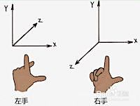

判断叉乘后的方向

- 在右手坐标系下，使用 **右手定则** 判断叉乘的方向
- 在左手坐标系下，使用 **左手定则** 判断叉乘的方向

### 1.5 惯性坐标系

定义：原点在模型坐标系原点上，坐标轴平行于世界坐标轴
作用：简化世界坐标系到模型坐标系的转换

与其他坐标系的转化：物体坐标系 ${旋转 \over \to}$ 惯性坐标系 ${平移 \over \to}$ 世界坐标系

## 2. 线形变换矩阵

### 2.1 2D 变换矩阵
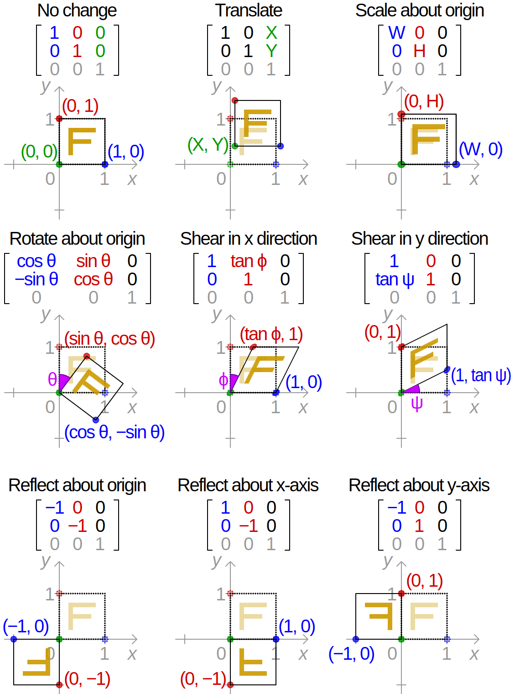

### 2.2 Scale

缩放比例为 K 在不同的坐标轴上的缩放比例不同，**这里假设 缩放方向 N 必过原点**

- 核心公式（推导见《3D 数学基础 图形与游戏开发》8.3.2），将三个基向量 v 分别沿 n 向量方向缩放后的向量构成的列矩阵为沿向量 n 的缩放矩阵
  $$
  v_{缩放后} = v + (K_{比例} - 1)(v \cdot n_{缩放方向})n_{缩放方向}
  $$

- 由 **基坐标** 构成的 **列向量** 变化矩阵
    $$
    \begin{array}{cc}
    \begin{bmatrix}
    K_x & 0 &0 \\
    0 & K_y & 0\\
    0 & 0 & K_z
    \end{bmatrix}&
    \begin{bmatrix}
    1+(K-1)x^2 & (K-1)yx & (K-1)zx\\
    (K-1)xy & 1+(K-1)y^2& (K-1)zy\\
    (K-1)xz & (K-1)yz& 1+(K-1)z^2
    \end{bmatrix}\\
    沿坐标轴缩放 & 沿任意向量N_{(x,y,z)}缩放K
    \end{array}
    $$

### 2.3 Reflect

缩放比例为 -1 时，就是镜像，**这里假设 缩放方向 n 必过原点**

- 核心公式，将三个基向量 v 分别沿 n 向量方向缩放 -1 （缩放核心公式的比例 K = -1）后的向量构成的列矩阵为沿向量 n 的镜像矩阵
  $$
  v_{镜像后} = v - 2(v \cdot n_{镜像方向})n_{镜像方向}
  $$

- 由 **基坐标** 构成的 **列向量** 变化矩阵
  $$
  \begin{array}{cccc}
  \begin{bmatrix}
  -1 & 0 & 0\\
  0 & 1 & 0\\
  0 & 0 & 1
  \end{bmatrix} &
  \begin{bmatrix}
  1 & 0 & 0\\
  0 & -1 & 0\\
  0 & 0 & 1
  \end{bmatrix} &
  \begin{bmatrix}
  -1 & 0 & 0\\
  0 & -1 & 0\\
  0 & 0 & 1
  \end{bmatrix} &
  \begin{bmatrix}
  1-2x^2 & -2yx & -2zx\\
  -2xy & 1-2y^2 & -2zy\\
  -2xz & -2yz & 1-2z^2
  \end{bmatrix}
  \\沿 X 轴镜像 & 沿 Y 轴镜像 & 沿 y=-x 轴镜像 & 沿任意向量N_{(x,y,z)}镜像 
  \end{array}
  $$

### 2.4 Rotate

设 在**右手坐标系**，旋转角**顺时针**为正方向

- 核心公式（推导见 《3D 数学基础 图形与游戏开发》8.2.3），将三个基向量 v 分别绕 n 旋转后的向量构成的列矩阵为 绕向量 n 的旋转矩阵
  $$
  v_{旋转后} =( v- (v \cdot n_{旋转轴})n_{旋转轴})cos\theta + (v \times n_{旋转轴})sin\theta + (v \cdot n_{旋转轴})n_{旋转轴}
  $$

- 由 **基坐标** 构成的 **列向量** 变化矩阵
    $$
    \begin{array}{cccc}
    \begin{bmatrix}
    1 & 0 & 0\\
    0 & cos\theta & sin\theta\\
    0 &-sin\theta & cos\theta
    \end{bmatrix} &
    \begin{bmatrix}
    cos\theta & 0 & -sin\theta\\
    0 & 1 & 0\\
    sin\theta & 0 & cos\theta
    \end{bmatrix} &
    \begin{bmatrix}
     cos\theta & sin\theta & 0\\
    -sin\theta & cos\theta & 0\\
    0 & 0 & 1
    \end{bmatrix} & = &
    \begin{bmatrix}
    (1-cos\theta)x^2 + cos\theta & (1-cos\theta)yx+sin\theta z & (1-cos\theta)zx - sin\theta y\\
    (1-cos\theta)xy - sin\theta z & (1-cos\theta)y^2 + cos\theta & -(1-cos\theta)zy + sin\theta x\\
    (1-cos\theta)xz + sin\theta y & (1-cos\theta)yz - sin\theta x & (1-cos\theta)z^2 + cos\theta
    \end{bmatrix}\\
    沿 X 轴旋转 & 沿 Y 轴旋转 & 沿 Z 轴旋转 & &沿任意向量N_{(x,y,z)}旋转 \theta
    \end{array}
    $$

### 2.5 Shear
变化后体积和面积保持不变

- 方法：将三个基向量 v 分别取出 x，y，z 中的任意一个值，乘以变换因子，在把它加到 x，y，z 中的其他轴的值上，例：取 x 乘以变换因子 K
  $$
  v_{切变后} =
  \begin{bmatrix}
  x \\ y + x * K_y \\ z + x * K_z
  \end{bmatrix}
  $$

- 由 **基坐标** 构成的 **列向量** 变化矩阵
  $$
  \begin{array}{cccc}
  \begin{bmatrix}
  1 & K_y & K_z\\
  0 & 1 & 0\\
  0 & 0 & 1
  \end{bmatrix} &
  \begin{bmatrix}
  1 & 0 & 0\\
  K_x & 1 & K_z\\
  0 & 0 & 1
  \end{bmatrix} &
  \begin{bmatrix}
  1 & 0 & 0\\
  0 & 1 & 0\\
  K_x & K_y & 1
  \end{bmatrix}
  \\沿 X 轴切变 & 沿 Y 轴切变  & 沿 Z 轴切变 
  \end{array}
  $$
  

## 3. 几何变换

### 3.1 基础变换

**可逆变换**

- 可以**撤销**原来的变换
- 变换矩阵是**非奇异**
- 变换矩阵行**列式不为零**
  

**等角变换**

- 变换后向量的**夹角不变**
- 包括：平移、旋转、均匀缩放（镜像不是）

**正交变换**

- 变换矩阵 列/行 互相保持垂直，切为单位向量
- 包括：平移、旋转、镜像
- 变换矩阵行列式为 $\pm1$
- **可根据 正交变换矩阵 = 逆矩阵 求逆矩阵**

**刚体变换**
- 只改变位置和方向
- 包括：平移、旋转（镜像不是）
  

###3.2 线性变换（可逆）

定义：

- 原点固定
- 直线变换后保持直线
- 网格保持 **平行** 且 **等距分布**

实质：线形变换不会导致平移（原点位置不变）
$$
F(ka + b) = kF(a) + F(b)
$$

###3.3 仿射变换（可逆）

仿射变换：*用于改变模型的位置和形状*

定义：
- 直线变换后保持直线
- 网格保持 **平行** 且 **等距分布**

实质：
- 仿射变换 = 线性变换 + 平移
- 一个向量空间 变换为 另一个向量空间
- 增加一个维度后可以同过 **高维度的线性变换** 代替 **低维度的仿射变换**

变换矩阵：例子，平移变换
$$
\begin{pmatrix}x & y & z & \color{red}1\end{pmatrix} \cdot 
\begin{bmatrix}
1 & 0 & 0 & \color{red}{\Delta x}\\
0 & 1 & 0 & \color{red}{\Delta y}\\
0 & 0 & 1 & \color{red}{\Delta z}\\
0 & 0 & 0 & \color{red}{1}\\
\end{bmatrix}
= \begin{pmatrix}x + \color{red}{\Delta x} & y + \color{red}{\Delta y} & z + \color{red}{\Delta z} & \color{red}1\end{pmatrix}
$$

同过 **高维度的线性变换** 代替 **低维度的仿射变换**
 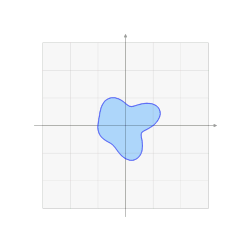

###3.4 投影变换（不可逆）

> 投影是降维操作

####3.4.1 正交投影

OpenGL 中的正交投影

> OpenGL 将世界坐标标准化为 X, Y, Z 范围均为 [-1,1] 的视角坐标内，然后在乘以透视矩阵得到二维图像

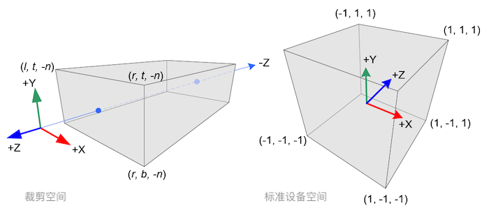

几何意义：
- 图像远近大小相同
- 点到投影后对应点的连线(投影线)与其他**投影线互相平行**
- 在线形缩放的基础上，沿投影方向的缩放比例为 0，其他缩放比例不变

简单的正交投影矩阵：
$$
\begin{array}{cccc}
\begin{bmatrix}
1 & 0 & 0\\
0 & 1 & 0\\
0 & 0 & 0
\end{bmatrix} &
\begin{bmatrix}
1 & 0 & 0\\
0 & 0 & 0\\
0 & 0 & 1
\end{bmatrix} &
\begin{bmatrix}
0 & 0 & 0\\
0 & 1 & 0\\
0 & 0 & 1
\end{bmatrix} &
\begin{bmatrix}
1- x^2 & -yx & -zx\\
-xy & 1- y^2 & -zy\\
-xz & -yz & 1- z^2
\end{bmatrix} 
\\沿 Z 轴投影到 XY平面 & 沿 Y 轴投影到 XZ平面  & 沿 X 轴投影到 YZ平面 & 沿 N(x,y,z) 投影到垂直于 N 的平面上
\end{array}
$$

OpenGL 中的正交投影矩阵 [推导过程](http://www.songho.ca/opengl/gl_projectionmatrix.html)

$$
\begin{bmatrix}
2 \over {right - left} & 0 & 0 & -{{right + left}\over{right - left}}\\
0 & 2 \over {top - bottom} & 0 & -{{top + bottom}\over{top - bottom}}\\
0 & 0 & -2 \over {far - near} & -{{far + near}\over{far - near}}\\
0 & 0 & 0 & 1
\end{bmatrix}
{
如果，投影体对称
\over
\Longrightarrow
}
\begin{bmatrix}
1 \over right & 0 & 0 & 0\\
0 & 1 \over top & 0 & 0\\
0 & 0 & -2 \over {far - near} & -{{far + near}\over{far - near}}\\
0 & 0 & 0 & 1
\end{bmatrix}
$$

####3.4.2 透视投影

OpenGL 中的透视投影

> OpenGL 将世界坐标标准化为 X, Y, Z 范围均为 [-1,1] 的视角坐标内，然后在乘以透视矩阵得到二维图像

几何意义：

- 图像近大远小
- 点到投影后对应点的连线(投影线)与其他**投影线相交于一点**（投影中心）
- 小孔成像：投影中心 在 投影平面 前

核心公式：

- 投影中心 在 投影平面 前, d < 0
  投影中心 在 投影平面 后, d > 0

  
  $$
  G_{投影后} (x^, , y^,, z^,) = (d \cdot x/z, d \cdot y/z, d), A_{投影前}(x,y,z)
  $$

OpenGL 中透视投影矩阵，[推导过程](http://www.songho.ca/opengl/gl_projectionmatrix.html)

> FOV：Field Of View (视场角) 决定视野范围，视场角越大，焦距越小

$$
\begin{bmatrix}
2 \cdot near \over {right - left} & 0 & {right + left}\over{right - left} & 0\\
0 & 2 \cdot near \over {top - bottom} & {top + bottom}\over{top - bottom} & 0\\
0 & 0 & -({far + near}) \over {far - near} & -2 \cdot far \cdot near\over{far - near}\\
0 & 0 & -1 & 0
\end{bmatrix}
{
如果，投影体对称
\over
\Longrightarrow
}
\begin{bmatrix}
near \over right & 0 & 0 & 0\\
0 & near \over top & 0 & 0\\
0 & 0 & -({far + near}) \over {far - near} & -2 \cdot far \cdot near\over{far - near}\\
0 & 0 & -1 & 0
\end{bmatrix}
$$

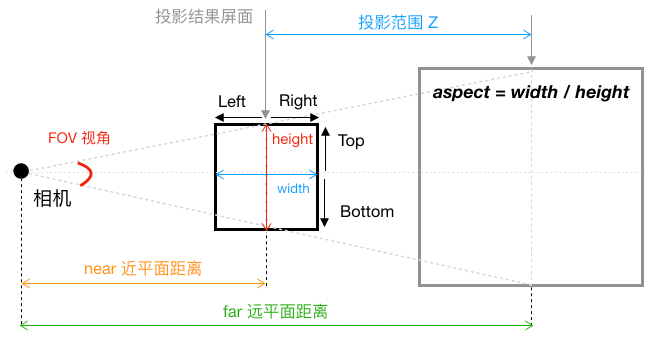

## 4. 3D 中的方位与角位移
**方位**：从上一方位旋转后的 结果值（单一状态，用欧拉角表示）
**角位移**：相对于上一方位旋转后的 偏移量（用四元数、矩阵表示）

### 4.1 欧拉角 (Euler angles)
定义：

- 欧拉角可以用来描述任意旋转，将一个角位移分解为三个互相垂直轴的**顺序旋转步骤**
- 旋转后，原来互相垂直的轴可能不再垂直，**当前步骤只能影响下一个旋转步骤，不能影响之前的旋转步骤**，通过这个特性我们可以选择**适合的旋转方式 (如：YXZ）**来避免万像锁的发生
- 这里**默认右手坐标系，逆时针为正**，任意三个轴可以作为旋转轴，下图仅为举例
heading：绕**惯性坐标系**的 Y 轴旋转
yaw：绕**模型坐标系**的 Y 轴旋转 

优点：

- 仅需要三个角度值，节省内存
- 表示直观（便于显示和输入方位）
- 任意三个数对于欧拉角都是合法的

缺点：

- 欧拉角之间求差值（角位移）困难
- 欧拉角的方位表达方式不唯一（n = n + 360）
- 由于三个角度不互相独立，pich 135 = heading 180 + pich 45 + bank 180
  （通过限制角的范围解决，heading 和 bank 限制在 -180 ～ 180，pitch 限制在 -90 ～90）
- 万向锁问题（避免方法：**重新排列角度的旋转顺序**，但万向锁仍可能产生）

[万向锁](http://v.youku.com/v_show/id_XNzkyOTIyMTI=.html)：

- 当沿着任意角位移 90 度时，导致两个方向的旋转轴同线，导致三次旋转中有两次旋转的效果是一样的
- 在万向锁的情况下仍可以旋转到想要的位置，但必须同时旋转三个轴向，这时物体没有按照期望的方式旋转，下图的箭头如果是相机，则相机会发生抖动

|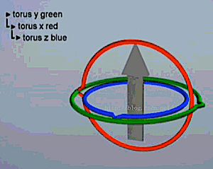|  |  |
| :----: | :----: | :----: |
| 万向锁 |**发生万向锁后**的旋转|期望的旋转|

### 4.2 四元数的相关知识

#### 4.2.1 复数

[复数](https://en.wikipedia.org/wiki/Complex_number)是一种复合的数字，$C_{复数} = a + b \cdot i$ ，其中 a、b 为实数，$i$ 为虚数，$i^2 = -1$

- 复数通过 **实部 a 和 虚部 b** 构成的二维虚平面，将一维的数扩展到二维平面
- $i$ 只是区分 实部  a 和 虚部 b 的标记，这样可以把复数用二维的向量表示
  加法：$(a + bi) + (c + di) = (a + c) + (b+d)i$
  乘法：$(a + bi) *(c + di) = (ac - bd) + (bc+ad)i$
- 复数乘以 $i$ 的几何意义，在二维平面上逆时针旋转 90 度
  $(a + b \cdot i) * i = a*i + b*i^2 = -b + a \cdot i$ 

#### 4.2.2 欧拉旋转定理

这里 $a = cos \phi, b = sin \phi, \phi$ 是从上一方位到当前方位的角位移，复数值表示当前方位 则 $c_{方位} =  a + b \cdot i$ 在极坐标下表示为 $e_{方位} = cos \phi + sin \phi \cdot i$
在极坐标下，复数能够更方便的表示旋转角的变化：

1. **连续的旋转可以用两个复数的乘积表示**
   例： $e_1$ 为先旋转 $\phi$，$e_2$ 再旋转 $\theta$，则根据 $i^2 = -1$ 以及[和差公式](https://en.wikipedia.org/wiki/Trigonometric_functions)可得最后的方位
   $$
   \begin{align}
   e_1 &= cos \phi + sin \phi \cdot i \\
   e_2 &= cos \theta + sin \theta \cdot i \\
   e &= cos(\phi + \theta) + sin(\phi + \theta) \cdot i \\
   &= (cos \phi \cdot cos \theta - sin \phi \cdot sin \theta) +(sin \phi \cdot cos \theta + cos \phi \cdot sin \theta) \cdot i \\
   &= (cos \phi + sin \phi \cdot i )(cos \theta + sin \theta \cdot i) \\
   &= e_1 \cdot e_2
   \end{align}
   $$

2. 在不知道当前角位移的情况下，**可以通过当前方位+角位移计算出之后的方位**

#### 4.2.3 三维空间旋转的拆分

四元数在表示三维空间旋转的方式时采用**轴角式（Axis-angle）**的旋转
轴角式旋转方法如下图，v 绕过原点的方向向量 u 逆时针旋转 $\theta$ 得到 v ’ （图中采用右手坐标系，逆时针旋转方向为正方向）

拆分轴角式旋转：

1. 如下图 A，假设 u 是单位向量
   $$
   \begin{align}
   v &= v_{||} + v_{\bot}\\
   v_{||} &= v_{||}'\\
   v_{||} &= proj_u(v) = {u \cdot v \over u \cdot u}u = {u \cdot v \over ||u||^2}u = (u \cdot v)u\\
   v_{\bot} &= v - v_{||} = v - (u \cdot v)u
   \end{align}
   $$

2. 如下图 B，C：w 既垂直于 u 又垂直于 $v_{\bot}$
   $$
   \begin{align}
   w &= u \times v_{\bot}\\
   ||w|| &= ||u \times v_{\bot}|| \\
   &= ||u|| \cdot ||v_{\bot}|| \cdot sin{\pi \over 2}\\
   &= ||v_{\bot}|| \\\\
   v_{\bot}' &= v_v' + v_w'\\
   &= v_{\bot} \cdot cos\theta + w \cdot sin\theta \\
   &= v_{\bot} \cdot cos\theta + (u \times v_{\bot})sin\theta
   \end{align}
   $$

3. 结合 1，2 可得
   $$
   v' = v \cdot cos\theta + (u\cdot v)u(1 - cos\theta)+(u \times v)sin\theta
   $$

### 4.3 四元数 (Quaternion)

> 相对于复数的二维空间，为了解决三维空间的旋转变化问题，爱尔兰数学家 William Rowan Hamilton 把复数进行了推广，也就是四元数
>
> **四元数包含旋转方向**： 3D 中的一个旋转对应正向和反向旋转的两个四元数，不是一一对应的

定义：**四元数表示角位移的大小**

- 与复数类似，四元数由 1 个实部 和 3 个虚部构成。其中，a、b、c 、d 为实数，$i$ 为虚数
  $\vec Q_{四元数} = a + b \cdot i_x + c \cdot i_y + d \cdot i_z$

- $i$ 代表旋转，$-i$ 代表反向旋转
  $$
  \begin{align}
  i_x * i_y * i_z &= i_x * i_x = i_y * i_y = i_z * i_z = -1\\
  i_x &= i_y * i_z  = - i_z * i_y = - i_x\\
  -i_y &= i_x * i_z \\
  \end{align}
  $$

 - 四元数的 3 个虚数 $i$ 之间的乘法与向量之间的点积结果形式很类似，于是四元数有了另外一种表示形式
$$
\begin{align}
\vec Q_{四元数} &= w + x \cdot i_x + y \cdot i_y + z \cdot i_z \\
&= (x, y, z, w) \\
&= (\vec u, w)
\end{align}
$$

优点：

- **平滑差值**：slerp 和 squad 提供了方位间的平滑差值**（矩阵和欧拉角都没有这个功能）**
- 快速连接和角位移求逆：
  多个角位移 ${四元数叉乘 \over \to}$ 单个角位移（比矩阵快）
  反角位移 = 四元数的共轭（比矩阵快）

缺点：

- 四元数比欧拉角多存储一个数（当保存大量角位移时尤为明显，如存储动画数据）
- 浮点数舍入误差和随意输入，会导致四元数不合法（可以通过四元数标准化解决，确保四元数为单位大小）
- 难以直接使用

#### 4.3.1 四元数的运算

- **乘法，合并两个四元数的偏移量，得到总的角位移**
  四元数的乘法有很多种，其中最常用的一种是格拉丝曼积，与数学多项式乘法相同（与复数乘法概念相同）
  乘法满足结合律：abc = (ab)c = a(bc)
  但不符合交换律：ab != ba
  $$
  \begin{align}
  \vec Q_1 \vec Q_2 &= w_1w_2 - \vec u_1 \cdot \vec u_2 + w_1 \vec u_2 + w_2 \vec u_1 + \vec u_1 \times \vec u_2\\
  &= ((w_1 \vec u_2 + w_2 \vec u_1 +  \vec u_1 \times \vec u_2), (w_1w_2 - \vec u_1 \cdot \vec u_2))
  \end{align}
  $$

- 四元数与标量相乘、点积、加法、叉乘、单位化，均与四维向量的点积相同，以点积为例
  $$
  \begin{align}
  \vec Q_1 \cdot \vec Q_2 &= (w_1, x_1, y_1, z_1)(w_2, x_2, y_2, z_2) \\
  &= w_1w_2 + x_1 x_2 + y_1y_2 + z_1z_2
  \end{align}
  $$

- 求模：代表一个四维的长度，与向量的求模方法一致
  $$
  ||\vec Q|| = \sqrt{w^2 + \vec u \cdot \vec u} = \sqrt{w^2 + x^2 + y^2 + z^2}
  $$

- 共轭：实部相同，虚部相反（与复数共轭概念相同）
  $$
  \vec  Q^* \vec  Q = (-\vec u, w) (\vec u,w) = ||\vec Q||^2 = \vec Q \cdot \vec Q
  $$

- 求逆：**为了计算四元数的 "差"**，例
  给定方位 A 和 B，求 A 旋转到 B 的**角位移 d**，即：Ad = B，$d = A^{-1}B$
  $$
  \begin{align}
  \vec Q\vec Q^{-1} &= 1\\
  \vec Q^* \vec Q\vec Q^{-1} &= \vec Q^*\\
  ||\vec Q||^2 \cdot \vec Q^{-1} &= \vec Q^*\\
  \vec Q^{-1} &= {\vec Q^* \over ||\vec Q||^2}\\
  \end{align}
  $$

- 单位四元数：任意四元数乘以单位四元数后保持不变，$(\vec 0, \pm 1)$，模为 1
  **单位四元数的 逆 = 共轭**，由于共轭比逆好求出，一般用四元数的共轭代替逆使用
  几何上存在两个单位四元数 -u 和 u，因为他们几何意义相同都表示没有位移，但数学上只有 u
  $$
  Q_{单位} = {Q \over ||Q||}\\
  Q_{单位}Q_1 = Q_1Q_{单位} = Q_1\\
  ((w_1 \vec u + w \vec u_1 +  \vec u_1 \times \vec u), (w_1w - \vec u_1 \cdot \vec u)) = (\vec u_1, w_1)
  $$

#### 4.3.2 四元数默认在极坐标下

**极坐标下的优势：使四元数的运算和向量的运算方法一致**

由 4.2.1 复数在笛卡尔坐标和极坐标的转换方式可得，四元数在

- 笛卡尔坐标下为
  $\vec Q = (x, y, z, w) = (\vec u, w)$
- 极坐标下为，其中 $\theta$ 为绕 $\vec u$ 旋转后的角位移（旋转方式见 4.2.3，[推导到极坐标](https://krasjet.github.io/quaternion/quaternion.pdf)）
  $\vec Q  = (x sin{\theta \over 2}, y sin{\theta \over 2},z sin{\theta \over 2}, cos{\theta \over 2}) = (\vec u sin{\theta \over 2}, cos{\theta \over 2})$

**只有旋转轴 u 为单位向量时，下面公式才成立**

- 用指数代替四元数：根据旋转角位移 $\theta$ 和旋转轴 u 求出四元数
  $$
  e^{(\vec u {\theta \over 2}, 0)} = (\vec usin{\theta \over 2}, cos{\theta \over 2})
  $$

- 对数：根据四元数和旋转轴 u 求出旋转角位移 $\theta$
  $$
  log_e(（\vec u sin{\theta \over 2}, cos{\theta \over 2}）) = (\vec u {\theta \over 2}, 0)
  $$

- 将点 P 绕 $ \vec u $ 旋转 $ \theta $ 度
  $P_{旋转后} = aPa^{-1}, a = (\vec u sin{\theta \over 2}, cos{\theta \over 2})$

- 将点 P 绕 $ \vec u $ 旋转 $ \theta $ 度后再旋转 $\alpha$ 度（方位的叠加是点乘）
  $P_{旋转后} = baPa^{-1}b^{-1} = (ba)P(ba)^{-1},a = (\vec u  sin{\theta \over 2},cos{\theta \over 2}),b = (\vec u sin{\alpha \over 2},cos{\alpha \over 2})$

- **四元数求幂**：四元数的 x 次幂等同于将它的旋转角缩放 x 倍
  $$
  (\vec u sin{\theta \over 2}, cos{\theta \over 2})^x
  = (\vec u {sin({\theta \over 2}x)\over sin{\theta \over 2}}, cos({\theta \over 2}x))
  $$

#### 4.3.3 四元数的常用插值方法

所有插值用的旋转四元数**都是单位四元数**
插值要采用弧面最短路径

- $Q$ 和 $-Q$ 代表不同的旋转角度得到的相同方位，在插值时会有不同的结果，如下图：可以将 q0 和 q1（蓝色的弧）插值，这会导致 3D 空间的向量旋转接近 360 度，而实际上这两个旋转相差并没有那么多，所以 q0 和 -q1（红色的弧）的插值才是插值的最短路径
- 每次插值前要通过 $cos\theta = q_0 \cdot q_1$ 判断 q0 和 q1 的夹角是否为钝角，若为钝角将 q1 改为 -q1 来计算插值

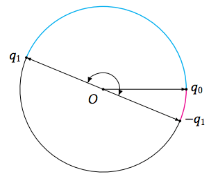

**线形插值**（Lerp：**L**inear Int**erp**olation）

- 对四元数插值后，得到的结果不是单位四元数，插值的弧度越大缺点越明显
- 公式：$Q_t = (1- t)Q_0 + t Q_1, t$ 为插值比例

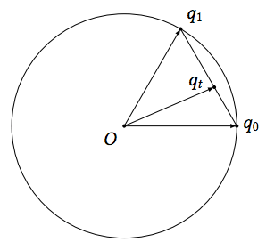

**正规化线性插值**（Nlerp：**N**ormalized **L**inear Int**erp**olation）

- 对四元数插值后，虽然把弦等分了，但是弦上对应的弧却不是等分的，插值的弧度越大缺点越明显
- 公式：$Q_t = {{ (1- t)Q_0 + tQ_1}\over{||(1- t)Q_0 + tQ_1||}}, t$ 为插值比例

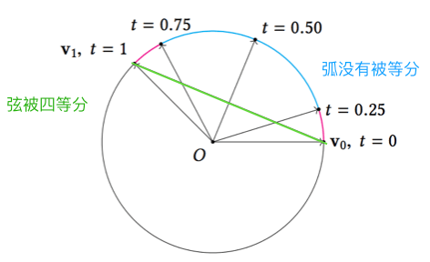

**旋转角度球面线性插值**（slerp：**S**pherical **L**inear Int**erp**olation）

- 对单个角度做线形插值，做到固定角速度，无法平滑过渡连接不同方向的角度
- 公式 1：这里用的四元数都是单位四元数，所以有 $Q^{-1} = Q^*,  t$ 为插值比例
  $$
  Q_t = Q_0(Q_0^{-1}Q_1)^t = Q_0(Q_0^* Q_1)^t​
  $$

- 公式 2：效率比公式 1 高，其中 $\theta = cos^{-1}(Q_0\cdot Q_1)$
  $$
  Q_t = {sin((1 - t)\theta) \over sin\theta} Q_0 + {sin(t\theta) \over sin\theta}Q_1
  $$

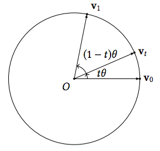

**Slerp 和 Nlerp 的比较**

- 效率上 Nlerp 比 Slerp 高
  效果上 Nlerp 和 Slerp 在单位四元数之间的夹⻆ θ 非常小时差别不大，夹角越大 Nlerp 的效果越差
- 单位四元数之间的夹⻆ θ 非常小，那么 sinθ 可能会由于浮点数的误差被近似为 0.0，从而导致除以 0 的错误。我们在实施 Slerp 之前，需要检查两个四元数的夹⻆是否过小一旦发现这种问题，我们就必须改用 Nlerp 对两个四元数进行插值，这时候 Nlerp 的误差非常小所以基本不会与真正的 Slerp 有什么区别 

#### 4.3.4 贝塞尔曲线和 Squad 插值

**样条（Spline）**：在一个向量序列 $v_0,v_1,...,v_n$ 中分别对每对向量 $v_i,v_{i+1}$ 进行插值后互相连接得到的曲线

**贝塞尔曲线（Bézier）**：通过不断在现有点的基础上添加控制点，使最终得到的曲线更加平滑

三次贝塞尔曲线：

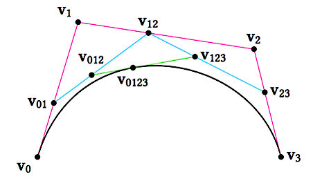

插值方式可以用 lerp、Slerp 等方式，上图采用 de Casteljau 算法构造贝塞尔曲线
上图采用 lerp 方式插值，插值方程为：
$$
v_t = (1 − t)^3v_0 + 3(1 − t)^2tv_1 + 3(1 − t)t^2v_2 + t^3v_3
$$
$de Casteljau$ 算法构造贝塞尔曲线的过程为：

- 第一次贝塞尔曲线，由相邻的基础点得到插值点 $v_{01}、v_{12}、v_{23}$
- 第二次贝塞尔曲线，由上次贝塞尔的插值点得到本次的插值点 $v_{012}、v_{123}$
- 第三次贝塞尔曲线，由上次贝塞尔的插值点得到本次的插值点 $v_{0123}$

**球面四边形插值**（Squad：**S**pherical and **Quad**rangle）

- 平滑过渡连接不同方向的旋转角，效率最低，效果最好
- Squad 的插值方法类似贝塞尔曲线的构造过程，**由于取基础点的方式不同，效率比构造贝塞尔曲线要高**
  Squad 的插值过程中可以用 lerp、Slerp 等方式插值
  如果使用 lerp 插值，**插值参数为 2t(1-t)，而非 t**
  插值方程为：

$$
v_t = (2t^2 − 2t + 1)(1 − t)v_0 + 2(1 − t)^2tv_1 + 2(1 − t)t^2v_2 + t(2t^2 − 2t + 1)v_3
$$

  插值步骤为：
1. 由基础点得到插值点 $v_{12}，v_{03}$
2. 根据上次的插值点得出本次的插值点 $v_{0312}$

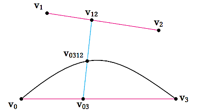

三次贝塞尔曲线和 Squad 插值构造的曲线对比：

### 4.4 欧拉角、旋转矩阵、四元数的互相转换

#### 4.4.1 欧拉角和旋转矩阵

[欧拉角](#4.1 欧拉角 (Euler angles)) $ \to $ 旋转矩阵

- 这里的旋转矩阵和 [2.4 Rotate](#2.4 Rotate)  类似，这里的欧拉角操作的模型的坐标系

- 设在**右手坐标系**，矩阵**列向量**存储，旋转角**逆时针**为正方向（改变的角度方向取反），则
  最后的转换矩阵为 Heading/Pich/Roll 按需要的顺序相乘的结果（HPR 为相机避免万向死锁的最佳顺序）
  $$
  \begin{align}
  Heading &= 
  \begin{bmatrix}
  cosH & 0 & sinH\\
  0 & 1 & 0\\
  -sinH & 0 & cosH
  \end{bmatrix} \\
  Pich &=
  \begin{bmatrix}
  1 & 0 & 0\\
  0 & cosP & -sinP\\
  0 & sinP & cosP
  \end{bmatrix} 
  \\
  Roll &=
  \begin{bmatrix}
  cosR & -sinR & 0\\
  sinR & cosR & 0\\
  0 & 0 & 1
  \end{bmatrix} \\
  M_{HPR} &= 
  \begin{bmatrix}
  cosHcosR+sinHsinPsinR & -cosHsinR+sinHsinPcosR & sinHcosP \\
  sinRcosP & cosRcosP & -sinP\\
  -sinHcosR+cosHsinPsinR & sinRsinH+cosHsinPcosR & cosHcosP
  \end{bmatrix}
  \end{align}\\
  $$

旋转矩阵 $ \to$ [欧拉角](#4.1 欧拉角 (Euler angles))

> 转换后的欧拉角是限制欧拉角，即 Heading 和 Roll 范围为 $\pm$180 度，Pich 的范围为 90 度 

当矩阵每列都是单位向量时，矩阵为正交矩阵，则
$$
M \cdot M^{-1} = M \cdot M^T = I\\
M^{-1} = M^T\\
$$

1. 若 $Pich \neq \pm 90$，由欧拉角转矩阵的公式可得：

$$
\begin{align}
\begin{bmatrix}
m11 & m12 & m13\\
m21 & m22 & m23\\
m31 & m32 & m33
\end{bmatrix}
&= 
\begin{bmatrix}
cosHcosR+sinHsinPsinR & -cosHsinR+sinHsinPcosR & sinHcosP \\
sinRcosP & cosRcosP & -sinP\\
-sinHcosR+cosHsinPsinR & sinRsinH+cosHsinPcosR & cosHcosP
\end{bmatrix}\\
\\
m23 &= -sinP\\
arcsin(-m23) &= P\\
\\
m13 &= sinHcosP\\
m33 &= cosHcosP\\
{m13 \over m33} &= tanH\\
arctan({m13 \over m33}) &= H\\
\\
m21 &= sinRcosP\\
m22 &= cosRcosP\\
arctan({m21 \over m22}) &= R\\
\end{align}
$$

2. 若 $Pich = \pm 90$，是万向锁情况，此时 Heading 和 Roll 绕同样的轴竖直旋转，默认旋转的最后一步 Roll 不转，即 Roll = 0 ，由欧拉角转矩阵的公式可得：

$$
\begin{align}
\begin{bmatrix}
m11 & m12 & m13\\
m21 & m22 & m23\\
m31 & m32 & m33
\end{bmatrix}
&= 
\begin{bmatrix}
cosH & sinHsinP & 0 \\
0 & 0 & -sinP\\
-sinH & cosHsinP & 0
\end{bmatrix}\\
\\
m11 &= cosH\\
m13 &= -sinH\\
-arctan({m13\over m11}) &= H
\end{align}
$$

#### 4.4.2 四元数和旋转矩阵

[四元数](#4.3 四元数 (Quaternion)) $ \to$ 旋转矩阵 

设四元数为 $\vec Q = (\vec n, cos{ \theta \over 2 }) = (x,y,z,w)$，绕 n 旋转 $\theta$ ，由 [2.4 Rotate 沿任意方向旋转的矩阵](#2.4 Rotate) 得旋转矩阵 M：
$$
\begin{bmatrix}
(1-cos\theta)x^2 + cos\theta & (1-cos\theta)yx+sin\theta z & (1-cos\theta)zx - sin\theta y\\
(1-cos\theta)xy - sin\theta z & (1-cos\theta)y^2 + cos\theta & -(1-cos\theta)zy + sin\theta x\\
(1-cos\theta)xz + sin\theta y & (1-cos\theta)yz - sin\theta x & (1-cos\theta)z^2 + cos\theta
\end{bmatrix}
\to M = 
\begin{bmatrix}
1-2y^2-2z^2 & 2xy+2wz & 2xz-2wy\\
2xy-2wz & 1-2x^2-2z^2 & 2yz+2wx\\
2xz+2wy & 2yz-2wx & 1-2x^2-2y^2
\end{bmatrix}
$$

旋转矩阵 $\to $ [四元数](#4.3 四元数 (Quaternion))

1. 由四元数转旋转矩阵可知：

$$
\begin{align}
\begin{bmatrix}
m11 & m12 & m13\\
m21 & m22 & m23\\
m31 & m32 & m33
\end{bmatrix}
&= 
\begin{bmatrix}
1-2y^2-2z^2 & 2xy+2wz & 2xz-2wy\\
2xy-2wz & 1-2x^2-2z^2 & 2yz+2wx\\
2xz+2wy & 2yz-2wx & 1-2x^2-2y^2
\end{bmatrix}\\\\
m11+m22+m33
&= (1-2y^2-2z^2)+(1-2x^2-2z^2)+(1-2x^2-2y^2)\\
&= 3-4(x^2+y^2+z^2)\\
&= 3-4(1-w^2)\\
&= 4w^2-1\\
\\
w&={\sqrt{m11+m22+m33+1} \over 2}

\end{align}
$$

2. 使 m11、m22、m33 其中两个为负，一个为正可得：

$$
\begin{align}
x &={\sqrt{m11-m22-m33+1} \over 2}\\
y &={\sqrt{-m11+m22-m33+1} \over 2}\\
z &={\sqrt{-m11-m22+m33+1} \over 2}
\end{align}
$$

以上方法得到的**四元数总是正的**，没有判断四元数符号的依据

3. 在由：

$$
\begin{align}
m12 + m21 &= 4xy\\
m12 - m21 &= 4wz\\
m31 + m13 &= 4xz\\
m31 - m13 &= 4wy\\
m23 + m32 &= 4yz\\
m23 - m32 &= 4wx\\
\end{align}
$$

4. 综上可得：
$$
\begin{align}
x &= {m23-m32 \over 4w}\\
情况一、w ={\sqrt{m11+m22+m33+1} \over 2} \to  y &= {m31-m13 \over 4w}\\
z &= {m12-m21 \over 4w}\\
\\
w &= {m23-m32 \over 4x}\\
情况二、x ={\sqrt{m11-m22-m33+1} \over 2} \to  y &= {m12+m21 \over 4x}\\
z &= {m31+m13 \over 4x}\\
\\
w &= {m31-m13 \over 4y}\\
情况三、y ={\sqrt{-m11+m22-m33+1} \over 2} \to  x &= {m12+m21 \over 4y}\\
z &= {m23+m32 \over 4y}\\
\\
w &= {m12-m21 \over 4z}\\
情况四、z ={\sqrt{-m11-m22+m33+1} \over 2} \to  x &= {m31+m13 \over 4z}\\
y &= {m23+m32 \over 4z}
\end{align}
$$

5. 取 1、2 中得到的 w、x、y、z 的最大值是哪个来判断，选择哪种情况

#### 4.4.3 欧拉角和四元数

[四元数](#4.3 四元数 (Quaternion)) $ \to $ [欧拉角](#4.1 欧拉角 (Euler angles))

由 旋转矩阵 转 四元数 和 旋转矩阵 转 欧拉角的条件可得：
$$
\begin{align}
P &= \arcsin(-2(yz+wx)) \\
H &=
\begin{cases}
\arctan{2(xz-wy)\over0.5 - x^2 - y^2},& \cos P \neq 0 \\
\arctan{2(-xz-wy)\over0.5 - y^2 - z^2},& \cos P = 0
\end{cases}\\
R &=
\begin{cases}
\arctan{2(xy-wz)\over0.5 - x^2 - z^2},& \cos P \neq 0\\
0,& \cos P = 0
\end{cases}
\end{align}
$$

[欧拉角](#4.1 欧拉角 (Euler angles)) $\rightarrow$ [四元数](#4.3 四元数 (Quaternion))

由四元数的公式得，在**右手坐标系**下的欧拉角列向量 H、P、R 为：
$$
HPR=
\begin{bmatrix}
cos{H \over 2}\\\\ 0 \\-sin{H \over 2}\\ 0
\end{bmatrix}
\begin{bmatrix}
cos{P \over 2}\\\\ -sin{H \over 2} \\0 \\0
\end{bmatrix}
\begin{bmatrix}
cos{R \over 2}\\\\ 0\\ 0\\-sin{H \over 2}
\end{bmatrix}
= 
\begin{bmatrix}
cos{H \over 2}cos{P \over 2}cos{R \over 2}+sin{H \over 2}sin{P \over 2}sin{R \over 2}\\\\ 
-cos{H \over 2}sin{P \over 2}cos{R \over 2}-sin{H \over 2}cos{P \over 2}sin{R \over 2} \\
cos{H \over 2}sin{P \over 2}sin{R \over 2}-sin{H \over 2}cos{P \over 2}cos{R \over 2} \\
sin{H \over 2}sin{P \over 2}cos{R \over 2}-cos{H \over 2}cos{P \over 2}sin{R \over 2} 
\end{bmatrix}
$$

