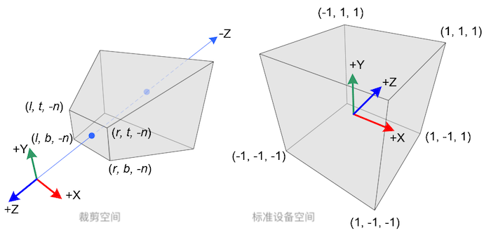

[TOC]

#十、实际应用

##1. 基础知识

###1.1 GPU 里矩阵间的计算方式

- 阵列操作：图像的矩阵中每个对应元素之间的操作
  例，**阵列**相乘
  $$
  \begin{bmatrix}
  \color{red}{a_{11}} & \color{red}{a_{21}} \\
  a_{12} & a_{22} \\
  \end{bmatrix}
  \begin{bmatrix}
  \color{green}{b_{11}} & b_{21} \\
  \color{green}{b_{12}} & b_{22} \\
  \end{bmatrix}
  =
  \begin{bmatrix}
  \color{red}{a_{11}}\color{green}{b_{11}} & \color{red}{a_{21}}b_{21} \\
  a_{12}\color{green}{b_{12}} & a_{22}b_{22} \\
  \end{bmatrix}
  $$

- 符合线性代数的条件下使用线性代数公式
  例，**矩阵**相乘：行 X 列
  $$
  \begin{bmatrix}
  \color{red}{a_{11}} & \color{red}{a_{21}} \\
  a_{12} & a_{22} \\
  \end{bmatrix}
  \begin{bmatrix}
  \color{green}{b_{11}} & b_{21} \\
  \color{green}{b_{12}} & b_{22} \\
  \end{bmatrix}
  =
  \begin{bmatrix}
  \color{red}{a_{11}}\color{green}{b_{11}}+\color{red}{a_{21}}\color{green}{b_{12}} &
  \color{red}{a_{11}}b_{21}+\color{red}{a_{21}}b_{22} \\
  a_{12}\color{green}{b_{11}}+a_{22}\color{green}{b_{12}} & a_{12}b_{21}+a_{22}b_{22} \\
  \end{bmatrix}
  $$

### 1.2 矩阵变换组合

这里按照 OpenGL 里的向量默认为**行向量**，矩阵默认由列向量构成
$$
\begin{align}
P_{世界} &= P_{物体} \cdot M_{物体 \to世界}\\
P_{相机} &= P_{世界} \cdot M_{世界 \to 相机}\\
&= P_{物体} \cdot M_{世界 \to 相机} \cdot M_{物体 \to世界}
\end{align}
$$

### 1.3 4D 齐次空间

齐次坐标：4D 向量有 4 个分量，前 3 个是标准的 x、y、z，第 4 个是 w，称为齐次坐标

几何意义：

- 3D 的点 A$(x,y,z)$ 可以看作在 4D 中的 w=1 平面上的点 A$(x,y,z,1)$
- 将 4D 点 B$(x,y,z,w)$ 投影到 3D 中为 B$(x/w, y/w, z/w)$
- 当 w = 0 时，B$(x,y,z, 0)$ 描述的**是无限远的方向**而不是位置
  

## 2. 线形变换矩阵

### 2.1 2D 变换矩阵

### 2.2 Scale

缩放比例为 K 在不同的坐标轴上的缩放比例不同，**这里假设 缩放方向 N 必过原点**

- 核心公式（推导见《3D 数学基础 图形与游戏开发》8.3.2），将三个基向量分别沿 N 向量方向缩放后的向量构成的列矩阵为 沿向量 N 的缩放矩阵
  $$
  V_{缩放后} = V + (K_{比例} - 1)(V \cdot N_{缩放方向})N_{缩放方向}
  $$

- 由 **基坐标** 构成的 **列向量** 变化矩阵
    $$
    \begin{array}{cc}
    \begin{bmatrix}
    K_x & 0 &0 \\
    0 & K_y & 0\\
    0 & 0 & K_z
    \end{bmatrix}&
    \begin{bmatrix}
    1+(K-1)x^2 & (K-1)yx & (K-1)zx\\
    (K-1)xy & 1+(K-1)y^2& (K-1)zy\\
    (K-1)xz & (K-1)yz& 1+(K-1)z^2
    \end{bmatrix}\\
    沿坐标轴缩放 & 沿任意向量缩放
    \end{array}
    $$

### 2.3 Reflect

缩放比例为 -1 时，就是镜像，**这里假设 缩放方向 N 必过原点**

- 核心公式
  $$
  V_{镜像后} = V - 2(V \cdot N_{镜像方向})N_{镜像方向}
  $$

- 由 **基坐标** 构成的 **列向量** 变化矩阵
  $$
  \begin{array}{cccc}
  \begin{bmatrix}
  1 & 0 & 0\\
  0 & -1 & 0\\
  0 & 0 & 1
  \end{bmatrix} &
  \begin{bmatrix}
  1 & 0 & 0\\
  0 & -1 & 0\\
  0 & 0 & 1
  \end{bmatrix} &
  \begin{bmatrix}
  -1 & 0 & 0\\
  0 & -1 & 0\\
  0 & 0 & 1
  \end{bmatrix} &
  \begin{bmatrix}
  1-2x^2 & -2yx & -2zx\\
  -2xy & 1-2y^2 & -2zy\\
  -2xz & -2yz & 1-2z^2
  \end{bmatrix}
  \\沿 X 轴镜像 & 沿 Y 轴镜像 & 沿 y=-x 轴镜像 & 沿任意向量N_{(x,y,z)}镜像 
  \end{array}
  $$

### 2.4 Rotate

设 旋转角 $\theta$ 顺时针为正方向

- 核心公式（推导见 《3D 数学基础 图形与游戏开发》8.2.3），将三个基向量分别绕 N 旋转后的向量构成的列矩阵为 绕向量 N 的旋转矩阵
  $$
  V_{旋转后} =( V- (V \cdot N_{旋转轴})N_{旋转轴})cos\theta + (V \times N_{旋转轴})sin\theta + (V \cdot N_{旋转轴})N_{旋转轴}
  $$

- 由 **基坐标** 构成的 **列向量** 变化矩阵
    $$
    \begin{array}{cccc}
    \begin{bmatrix}
    1 & 0 & 0\\
    0 & cos\theta & sin\theta\\
    0 &-sin\theta & cos\theta
    \end{bmatrix} &
    \begin{bmatrix}
    cos\theta & 0 & -sin\theta\\
    0 & 1 & 0\\
    sin\theta & 0 & cos\theta
    \end{bmatrix} &
    \begin{bmatrix}
     cos\theta & sin\theta & 0\\
    -sin\theta & cos\theta & 0\\
    0 & 0 & 1
    \end{bmatrix} &
    \begin{bmatrix}
    (1-cos\theta)x^2 + cos\theta & (1-cos\theta)yx+sin\theta z & (1-cos\theta)zx - sin\theta y\\
    (1-cos\theta)xy - sin\theta z & (1-cos\theta)y^2 + cos\theta & -(1-cos\theta)zy + sin\theta x\\
    (1-cos\theta)xz + sin\theta y & (1-cos\theta)yz - sin\theta x & (1-cos\theta)z^2 + cos\theta
    \end{bmatrix}\\
    沿 X 轴旋转 & 沿 Y 轴旋转 & 沿 Z 轴旋转 & 沿任意向量N_{(x,y,z)}旋转 
    \end{array}
    $$

### 2.5 Shear
变化后体积和面积保持不变

- 核心公式：
  $$
  V_{切变后} = V + N * k_{变换因子}
  $$

- 由 **基坐标** 构成的 **列向量** 变化矩阵
  $$
  \begin{array}{cccc}
  \begin{bmatrix}
  1 & K_y & K_z\\
  0 & 1 & 0\\
  0 & 0 & 1
  \end{bmatrix} &
  \begin{bmatrix}
  1 & 0 & 0\\
  K_x & 1 & K_z\\
  0 & 0 & 1
  \end{bmatrix} &
  \begin{bmatrix}
  1 & 0 & 0\\
  0 & 1 & 0\\
  K_x & K_y & 1
  \end{bmatrix}
  \\沿 X 轴切变 & 沿 Y 轴切变  & 沿 Z 轴切变 
  \end{array}
  $$
  

## 3. 几何变换

### 3.1 基本变换

**可逆变换**
- 可以**撤销**原来的变换
- 变换矩阵是**非奇异**
- 变换矩阵行**列式不为零**
  

**等角变换**

- 变换后向量的**夹角不变**
- 包括：平移、旋转、均匀缩放（镜像不是）

  
**正交变换**
- 变换矩阵 列/行 互相保持垂直，切为单位向量
- 包括：平移、旋转、镜像
- 变换矩阵行列式为 $\pm1$
- **可根据 正交变换矩阵 = 逆矩阵 求逆矩阵**
  

**刚体变换**
- 只改变位置和方向
- 包括：平移、旋转（镜像不是）
  

###3.2 线性变换（可逆）

定义：

- 原点固定
- 直线变换后保持直线
- 网格保持 **平行** 且 **等距分布**

实质：线形变换不会导致平移（原点位置不变）
$$
\begin{align}
F(a + b) &= F(a) + F(b)\\
F(ka) &= kF(a)
\end{align}
$$

###3.3 仿射变换（可逆）

仿射变换：*用于改变模型的位置和形状*

定义：
- 直线变换后保持直线
- 网格保持 **平行** 且 **等距分布**

实质：
- 仿射变换 = 线性变换 + 平移
- 一个向量空间 变换为 另一个向量空间
- 增加一个维度后可以同过 **高维度的线性变换** 代替 **低维度的仿射变换**

变换矩阵：例子，平移变换
$$
\begin{pmatrix}x & y & z & \color{red}1\end{pmatrix} \cdot 
\begin{bmatrix}
1 & 0 & 0 & \color{red}{\Delta x}\\
0 & 1 & 0 & \color{red}{\Delta y}\\
0 & 0 & 1 & \color{red}{\Delta z}\\
0 & 0 & 0 & \color{red}{1}\\
\end{bmatrix}
= \begin{pmatrix}x + \color{red}{\Delta x} & y + \color{red}{\Delta y} & z + \color{red}{\Delta z} & \color{red}1\end{pmatrix}
$$

同过 **高维度的线性变换** 代替 **低维度的仿射变换**
 
###3.4 投影变换（不可逆）

> 投影是降维操作

####3.4.1 正交投影
几何意义：
- 图像远近大小相同
- 点到投影后对应点的连线(投影线)与其他**投影线互相平行**
- 在线形缩放的基础上，沿投影方向的缩放比例为 0，其他缩放比例不变

正交投影矩阵：
$$
\begin{array}{cccc}
\begin{bmatrix}
1 & 0 & 0\\
0 & 1 & 0\\
0 & 0 & 0
\end{bmatrix} &
\begin{bmatrix}
1 & 0 & 0\\
0 & 0 & 0\\
0 & 0 & 1
\end{bmatrix} &
\begin{bmatrix}
0 & 0 & 0\\
0 & 1 & 0\\
0 & 0 & 1
\end{bmatrix} &
\begin{bmatrix}
1- x^2 & -yx & -zx\\
-xy & 1- y^2 & -zy\\
-xz & -yz & 1- z^2
\end{bmatrix} 
\\沿 Z 轴投影到 XY平面 & 沿 Y 轴投影到 XZ平面  & 沿 X 轴投影到 YZ平面 & 沿 N(x,y,z) 投影到垂直于 N 的平面上
\end{array}
$$

####3.4.2 透视投影
几何意义：
- 图像近大远小
- 点到投影后对应点的连线(投影线)与其他**投影线相交于一点**（投影中心）
- 小孔成像：投影中心 在 投影平面 前

核心公式：

- 投影中心 在 投影平面 前, d < 0
  投影中心 在 投影平面 后, d > 0
  

  $$
  G_{投影后} (x^, , y^,, z^,) = (d \cdot x/z, d \cdot y/z, d), A_{投影前}(x,y,z)
  $$
