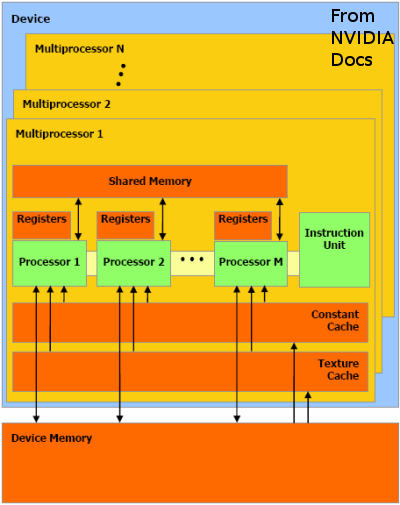
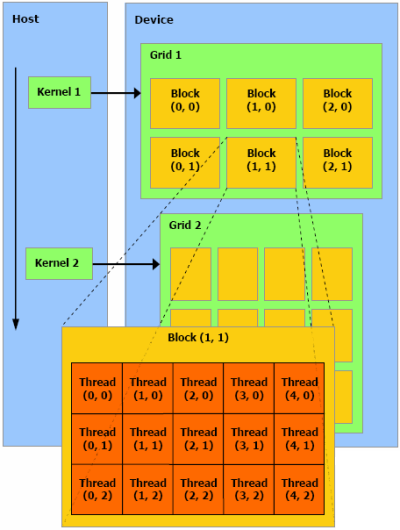
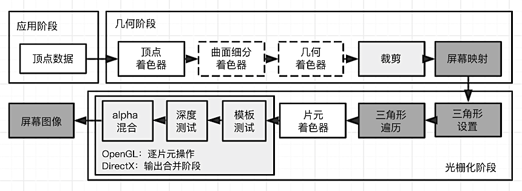

[TOC]

# 一、OpenGL 简介

>  OpenGL 作为图形硬件标准，是最通用的图形管线版本
>
>  使用 OpenGL 自带的数据类型可以确保各平台中每一种类型的大小都是统一的

##1. OpenGL 版本

**OpenGL 只是一个标准/规范，具体的实现是由驱动开发商针对特定显卡来实现**

从 OpenGL 3.0 开始，OpenGL 已经弃用经典管线功能（glBegin，变换矩阵，光照，雾，纹理坐标自动生成，等），这些功能可以在需要时由着色器实现

从  OpenGL 4.0 开始，OpenGL 明确删除了固定管线功能，但显卡厂商还在提供固定管线的驱动程序支持，因为还有很多人在用这些固定管线功能


## 2. OpenGL Context

OpenGL 命令执行的结果影响 OpenGL 状态（由 OpenGL context 保存，包括OpenGL 数据缓存）或 影响帧缓存

1. 使用 OpenGL 之前必须先创建 OpenGL Context，并 make current 将创建的 上下文作为当前线程的上下文

2. **OpenGL 标准并不定义如何创建 OpenGL Context，这个任务由其他标准定义**
   如GLX（linux）、WGL（windows）、EGL（一般在移动设备上用）

3. 上下文的描述类型有 **core profile (不包含任何弃用功能)** 或 **compatibility profile (包含任何弃用功能)** 两种
   如果创建的是 core profile OpenGL context，调用如 glBegin() 等兼容 API 将产生GL_INVALID_OPERATION 错误（用 glGetError() 查询）

4. Default Frame Buffer：由 外界创建 Context 的一部分，通过 Frame Buffer 将渲染内容显示在屏幕上
   Frame Buffer Objects：可以由 OpenGL 创建多个

5. 共享上下文

   Context 可以有多个，在某个线程创建后，所有 OpenGL 的操作都会转到这个线程来操作
   两个线程同时 make current 到同一个绘制上下文，会导致程序崩溃

   一般每个窗口都有一个上下文，可以保证上下文间的不互相影响
   通过**创建上下文时传入要共享的上下文**，多个窗口的上下文之间图形资源可以共享
   可以共享的：纹理、shader、Vertex Buffer 等，外部传入对象
   不可共享的：Frame Buffer Object、Vertex Array Object 等 OpenGL 内置容器**对象**


##3. OpenGL 的执行模型（Client - Server 模型）

> 主函数在 CPU 上执行，图形渲染在 GPU 上执行
> 虽然 GPU 可以编程，但这样的程序也需要在 CPU 上执行来操作 GPU

基本执行模型：CPU 上 push command 命令，GPU 上执行命令的渲染操作

- **应用程序 和 GPU 的执行通常是异步的**
  OpenGL API 调用返回 != OpenGL 在 GPU 上执行完了相应命令，但保证按调用顺序执行
  同步方式：**glFlush()** 强制发出所有 OpenGL 命令并在此函数返回后的有限时间内执行完这些 OpenGL 命令
  异步方式：**glFinish()** 等待直到**此函数之前**的 OpenGL 命令执行完毕才返回

- **应用程序 和 OpenGL 可以在也可以不在同一台计算机上执行**
  一个网络渲染的例子是通过 Windows 远程桌面在远程计算机上启动 OpenGL 程序，应用程序在远程计算机执行，而 OpenGL 命令在本地计算机执行（**将几何数据**而不是将渲染结果图像通过网络传输）

  > 当 Client 和 Server 位于**同一台计算机**上时，也称 GPU 为 Device，CPU 为 Host
  > Device、Host 这两个术语通常在用 GPU 进行通用计算时使用

- **内存管理**
  CPU 上由程序准备的缓存数据（buffer、texture 等）存储在显存（video memory）中，这些数据从程序到缓存中拷贝，也可以再次拷贝到程序的缓存中
- **数据绑定发生在 OpenGL 命令调用时**
  应用程序传送给 GPU 的数据在 OpenGL API 调用时解释，在调用返回时完成
  例，指针指向的数据给 OpenGL 传送数据，如 glBufferData()  在此 API 调用返回后修改指针指向的数据将不再对 OpenGL 状态产生影响


# 二、渲染管线

> 所谓 OpenGL 管线（OpenGL pipeline），就是指 OpenGL 的渲染过程，即从输入数据到最终产生渲染结果数据所经过的通路及所经受的处理

## 1. 图形硬件系统

一般来说，计算机的硬件结构如下图：

- 显存的带宽比内存的大很多（显存的位宽大）

- **内存** 和 **显存** 之间的 PCI 总线带宽过小是 CPU 和 GPU 交互的瓶颈

  > OpenGL 的**显示列表**，将一组绘制指令放到 GPU 上，CPU 只要发一条 "执行这个显示列表" 这些指令就执行，而不必每次渲染都发送大量指令到 GPU，从而节约 PCI 带宽 


### 1.1 GPU 硬件模型

GPU 的并行运算：与 CPU 上十几个线程的并行计算不同，GPU 的线程数可以达到上百万或更多

GPU 主要由 **显存(Device Memory)** 和 **流多处理器(Stream Multiprocessors)** 组成




### 1.2 [CUDA](http://eric_rollins.home.mindspring.com/ray/cuda.html) 的执行模型，[以 PTX ISA 为例](https://docs.nvidia.com/cuda/parallel-thread-execution/index.html)

- 将线程按 Grid、Block 两个层次分组，如下图
  Host：CPU 编程视图
  Device：GPU 编程视图
  

- Grid 存储模型，如下图
  Block 总在一个 GPU 的流多处理器上执行
  Block 间，线程通过全局存储（显存）通信
  Block 内，线程通过共享存储（由流多处理器的共享存储器提供）通信
  


### 1.3 OpenGL 的执行模型

- 将线程按 Dispath、Work Group、Invocation 三个层次分组，如下图
其中，Dispath 类似于 CUDA 的 Grid，Work Group 类似于 CUDA 的 Block
  


## 2. 渲染管线概览

### 2.1 基本的渲染管线流程

流程总览：

模型变换 $\to$ 视野变换 $\to$ 顶点处理（可能含有光照） $\to$ 
透视区域裁剪（得到裁剪后的坐标空间） $\to$ 齐次变换（得到标准化的坐标空间） $\to$ 视角变换（得到屏幕坐标）  $\to$ 
光栅化 $\to$ 片源处理，纹理，光照处理 $\to$ 光栅化（可选） $\to$ 缓冲帧

顶点变换过程：


### 2.2 渲染管线流程图

可编程：可以在需要时由 shader 实现
不可编程：具体方法由 OpenGL API 的驱动实现




### 2.3 Shader 中的接口一致性

- Vertex Shader 的 输入 和 应用程序的顶点属性数据接口 一致

- Vertex Shader 的 输出 和 Fragment Shader 对应的 输入 一致

- Fragment Shader 的 输出 和 帧缓存的颜色缓存接口 一致


固定管线功能阶段需要的一些特定输入输出由着色器的内置输出输入变量定义，如下图

> Tessellation（曲面细分，可选阶段）：
> 当 Tessellation 阶段存在时，只能给管线提供 GL_PATCHES 类型的图元
> 当 Tessellation 阶段不存在时，不能提供 GL_PATCHES 类型的图元
>
> - Tessellation Control Shader（TCS，细分控制着色器）
> - Tessellation Primitive Generation（细分图元生成）
> - Tessellation Evaluation Shader（TES，细分求值着色器）


# 三、纹理

## 1. 纹理环绕（坐标包装）

> 当**纹理坐标超出默认范围**时，每种纹理环绕方式都有不同的视觉效果输出

OpenGL 设置纹理不同坐标轴的环绕方式

```c
glTexParameteri(GL_TEXTURE_2D, GL_TEXTURE_WRAP_S, GL_NEAREST); //纹理坐标 s/u/x 轴的包装格式
glTexParameteri(GL_TEXTURE_2D, GL_TEXTURE_WRAP_T, GL_LINEAR);  //纹理坐标 t/v/y 轴的包装格式
```


| 环绕方式           | 描述                                                         |
| ------------------ | ------------------------------------------------------------ |
| GL_REPEAT          | 对纹理的默认行为，重复纹理图像                               |
| GL_MIRRORED_REPEAT | 和 GL_REPEAT 一样，但每次重复图片是镜像放置的                |
| GL_CLAMP_TO_EDGE   | 纹理坐标会被约束在 0 ～ 1之间，超出的部分会重复纹理坐标的边缘，产生一种边缘被拉伸的效果 |
| GL_CLAMP_TO_BORDER | 超出的坐标处的纹理为用户指定的边缘颜色                       |


## 2. 纹理过滤（采样）

> 当三维空间里面的多边形，变成二维屏幕上的一组像素的时候，对每个像素需要到相应纹理图像中进行采样，这个过程就称为纹理过滤 

纹理过滤的两种情况

- 纹理被缩小 `GL_TEXTURE_MIN_FILTER`：一个像素对应多个纹理单元
  例，一个 8 X 8 的纹理贴到远处正方形上，最后在屏幕上占了 2 X 2 个像素矩阵
- 纹理被放大 `GL_TEXTURE_MAG_FILTER`：一个纹理单元对应多个像素
  例，一个 2 X 2 的纹理贴到近处正方形上，最后在屏幕上占了 8 X 8 个像素矩阵


OpenGL 中针对放大和缩小的情况的设置

```c
glTexParameteri(GL_TEXTURE_2D, GL_TEXTURE_MIN_FILTER, GL_NEAREST); //缩小
glTexParameteri(GL_TEXTURE_2D, GL_TEXTURE_MAG_FILTER, GL_LINEAR);  //放大
```


### 2.1 最近点采样 GL_NEAREST

优点：效率最高
缺点：效果最差

方法：选择最接近中心点纹理坐标的 **1 个纹理单元**采样


### 2.2 双线性过滤 GL_LINEAR

优点：适于处理有一定精深的静态影像
缺点：不适用于绘制动态的物体，当三维物体很小时会产生深度赝样锯齿 (Depth Aliasing artifacts)

方法：选择最接近中心点纹理坐标的 2 X 2 纹理单元矩阵进行采样，取 **4 个纹理单元**采样的平均值


### 2.3 三线性过滤 GL_LINEAR_MIPMAP_LINEAR

> 多级渐远纹理 (Mipmap) 
> 效率高但是会占用一定的空间
> 一系列的纹理图像，后一个纹理图像是前一个的二分之一。距观察者的距离超过一定的阈值，OpenGL会使用不同的多级渐远纹理，即最适合物体的距离的那个。由于距离远，解析度不高也不会被用户注意到。
>
> 一张方形地板的多级渐远纹理如下图
>
> 

优点：效果最好，适用于动态物体或景深很大的场景
缺点：效率低，只能用于纹理被缩小的情况

方法：

1. 取 Mipmap 纹理中距离与当前屏幕上尺寸相近的两个纹理

2. 将 1 中选取的纹理 选择最接近中心点纹理坐标的 2 X 2 纹理单元矩阵进行采样（线性过滤）

3. 将 2 中两次采样的结果进行加权平均（**8 个纹理单元**采样），得到最后的采样数据


### 2.4 各向异性过滤

> 之前提到的三种过滤方式，默认纹理在 x，y 轴方向上的缩放程度是一致的
> 当纹理在 3D 场景中，出现一个轴的方向纹理放大，一个轴的方向纹理缩小的情况（**OpenGL 判定为纹理缩小**）需要使用各向异性过滤配合以上三种过滤方式来达到最佳的效果

优点：效果最好，使画面更加逼真
缺点：效率最低，由硬件实现

方法：

1. 确定 X、Y 方向的采样比例
   ScaleX = 纹理的宽 / 屏幕上显示的纹理的宽
   ScaleY = 纹理的高 / 屏幕上显示的纹理的高
   异向程度 = max(ScaleX, ScaleY) / min(ScaleX, ScaleY);

   例，64 X 64的纹理最后投影到屏幕上占了128 X 32 的像素矩阵
   ScaleX = 64.0 / 128.0 = 0.5;
   ScaleY = 64.0 / 32.0 = 2.0;
   异向程度 = 2.0 / 0.5 = 4;

2. 根据采样比例分别在 X、Y 方向上采用 *三线性过滤* 或 *双线性过滤* 获得采样数据，**采样的范围由异向程度决定，不是原来的 2 X 2 像素矩阵**

   例，64 X 64的纹理最后投影到屏幕上占了128 X 32 的像素矩阵
   异向程度为 4，且在 缩放方面 X 轴 > Y 轴，所以 X 轴采样 2 个像素，Y 轴采样 2 * 异向程度 = 8 个像素
   采样范围为最接近中心点纹理坐标的 2 X 8 的像素矩阵

OpenGL 中设置各向异性过滤

```c
glTexParameterf(GL_TEXTURE_2D, GL_TEXTURE_MAX_ANISOTROPY_EXT, 异向程度);
```

各向异性对比三线性


# 四、OpenGL 的加载（环境配置顺序）

## 1. 动态获取 OpenGL 函数地址

OpenGL 只是一个标准/规范，具体的实现是由驱动开发商针对特定显卡来实现，而且 OpenGL 驱动版本众多，它大多数函数的位置都**无法在编译时确定下来，需要在运行时查询**

因此，在编写与 OpenGL 相关的程序时需要开发者自己来获取 OpenGL 函数地址

相关库可以提供 OpenGL 函数获取地址后的头文件：[GLAD](https://github.com/Dav1dde/glad)


## 2. 创建上下文

OpenGL 创建上下文的操作在不同的操作系统上是不同的，所以需要开发者自己处理：**窗口的创建、定义上下文、处理用户输入**

相关库可以提供一个窗口和上下文用来渲染：[GLUT](http://freeglut.sourceforge.net/)、SDL、SFML、[GLFW](http://www.glfw.org/download.html)


# 参考

1. OpenGL 加载库 https://www.khronos.org/opengl/wiki/OpenGL_Loading_Library