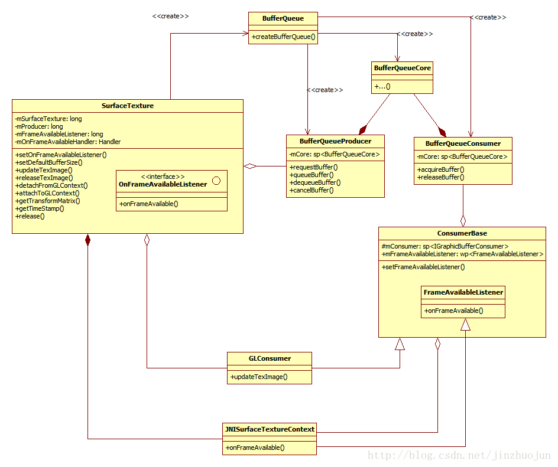
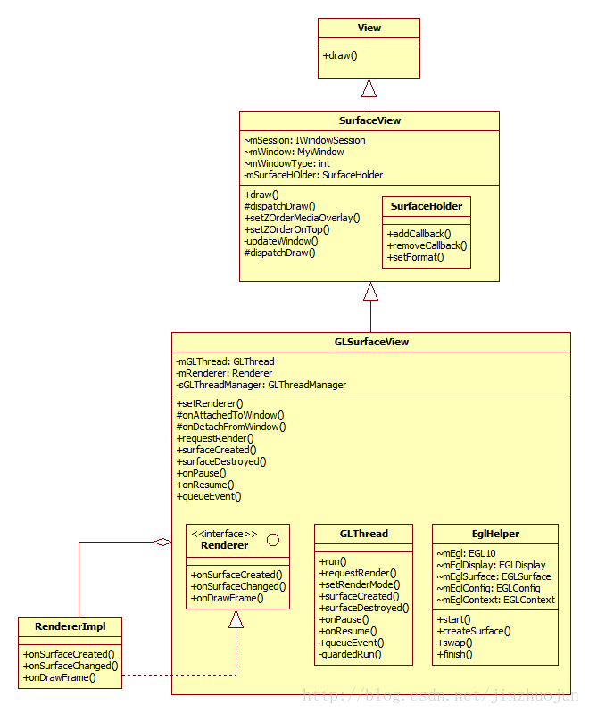
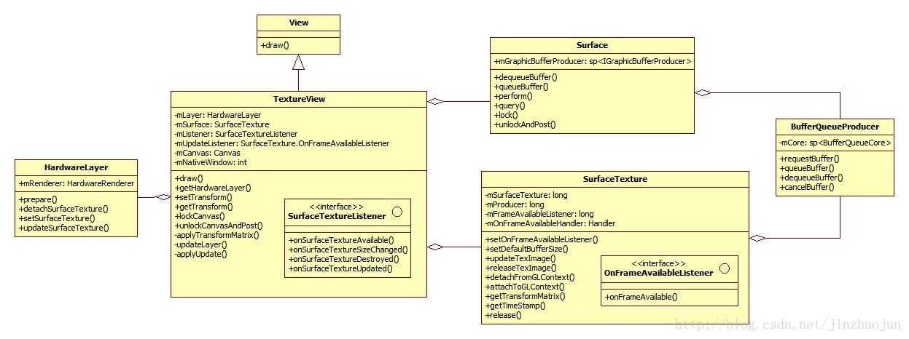
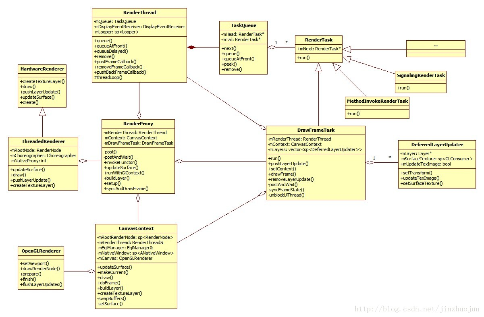

[TOC]

# 零、代码 Debug

> 关于性能的衡量 帧率/单帧时间，**建议采用单帧时间**
>
> 由于 帧率 = 60 / 单帧时间，他们之间的关系不是线性的，例如在减少同样时间消耗的情况下：
> 低帧率区间进步缓慢，每秒 10fps 下，帧时间减少 2ms，帧率提高到 10.2fps
> 高帧率区间进步明显，每秒 25fps 下，帧时间减少 2ms，帧率提高到 26.3fps


# 一、Android 平台

## 1. 数据的封装

### 1.1 Surface
内存中的一段绘图缓冲区，对 framebuffer 的 Java 封装对象


### 1.2 SurfaceTexture
内存中的一段绘图缓冲区，对 EGL texture 的 Java 封装对象

数据源：android.hardware.camera2, MediaCodec, MediaPlayer, 和 Allocation 这些类的目标视频数据输出对象

限制：API 11 存在，Android 3.0 及其后才能使用

特点：可以接收一个 EGL texture 的纹理 ID 来产生，可以做到**离线渲染**

关键方法：updateTexImage（从内容流中获取当前帧，使得内容流中的一些帧可以跳过）




SurfaceTexture 使用流程


## 2. 数据的展示和刷新

### 2.1 SurfaceView

父类：View

限制：API 1 存在

回调方法运行线程：主线程

优点：有自己的 Surface 来刷新，可以做到**局部刷新，独立线程刷新数据**

缺点：不能进行 Transition，Rotation，Scale 等变换，这导致 SurfaceView 在由于刷新不受主线程控制，**滑动时可能有黑边**

关键方法：getHolder（获取 SurfaceHolder ，SurfaceHolder 持有 Surface 数据对象）


### 2.2 GLSurfaceView

父类：SurfaceView

限制：API 3 存在，Android 1.5 及其后才能使用

关键方法：




### 2.3 TextureView

父类：View

限制：API 14 存在，Android 4.0 及其后才能使用，只能针对用于硬件加速（没有 GPU 就无法使用）

回调方法运行线程：主线程（在Android 5.0 引入渲染线程后，它是在渲染线程中做的）

特点：没有自己的 Surface 来刷新，使用所在的 window 来**全局刷新**，可以进行 Transition，Rotation，Scale 等变换，**滑动时没有黑边**

关键方法：

- getSurfaceTexture（可能返回 null）

- setSurfaceTextureListener

  ```java
  public DrawTextureView(Context context, AttributeSet attrs, int defStyleAttr) {
    super(context, attrs, defStyleAttr);
    this.setSurfaceTextureListener(this);
  }
  
  @Override
  public void onSurfaceTextureAvailable(SurfaceTexture surface, int width, int height) {
    mSurface = new Surface(surface);
  }
  
  @Override
  public void onSurfaceTextureSizeChanged(SurfaceTexture surface, int width, int height) {}
  
  @Override
  public boolean onSurfaceTextureDestroyed(SurfaceTexture surface) {  
    return true;
  }
  
  @Override
  public void onSurfaceTextureUpdated(SurfaceTexture surface) {}
  ```
  


### 2.4 Android 5.0 引入渲染线程




## 3. EGL 环境配置


## 4. 平台问题

## 5. Debug


# 二、iOS 平台


# 三、QT 平台


# 参考

- [A C++ Smart Pointer wrapper for use with JNI](https://www.studiofuga.com/2017/03/10/a-c-smart-pointer-wrapper-for-use-with-jni/)
- [SurfaceView、SurfaceHolder、Surface](https://blog.csdn.net/holmofy/article/details/66578852)
- [TextureView、SurfaceTexture、Surface](https://blog.csdn.net/Holmofy/article/details/66583879)
- [SurfaceView、TextureView、SurfaceTexture 等的区别](https://www.cnblogs.com/wytiger/p/5693569.html)